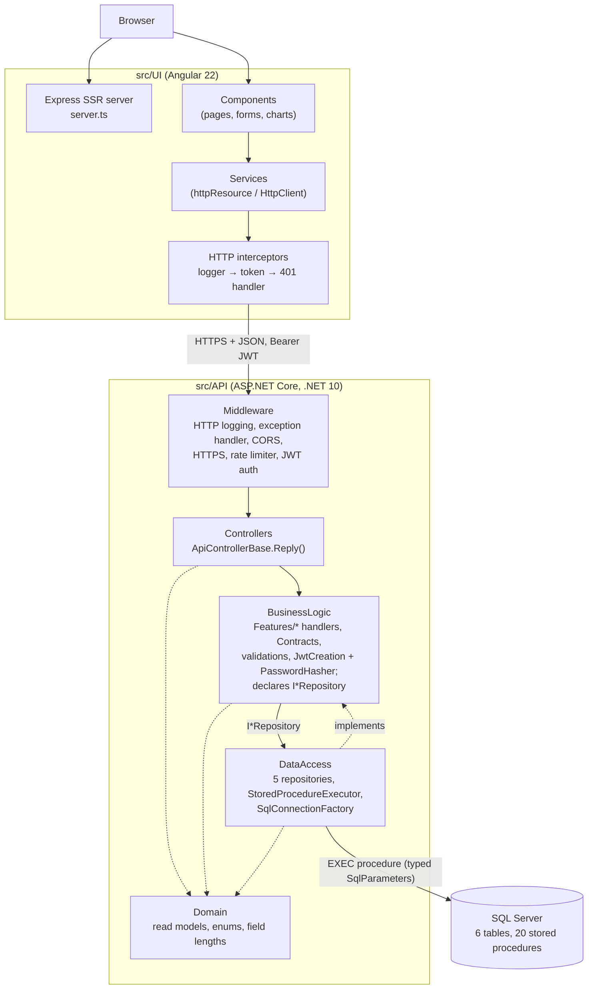
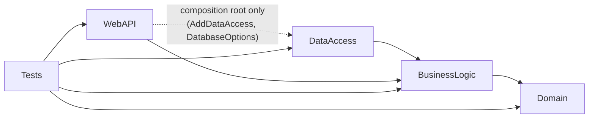
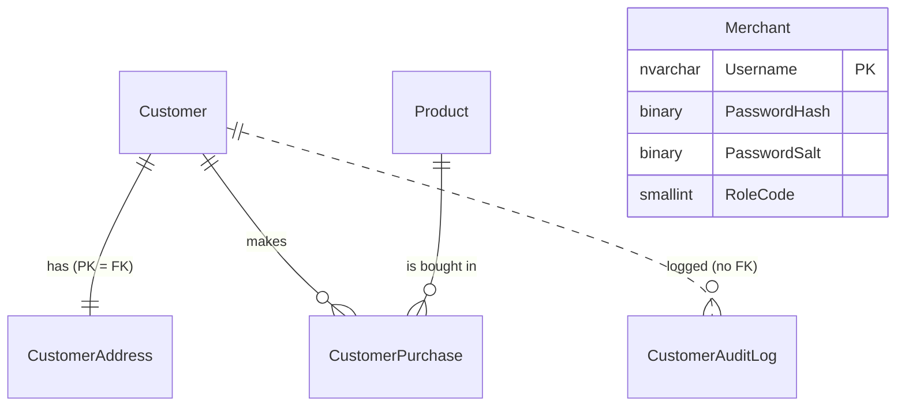

# Architecture & Design

> This document describes how the Customer Management System is built, as read from the source under `src/`, the build scripts and the tests. Statements that interpret the code rather than restate it are worded as such. The `ai_docs/` folder holds shorter, task-oriented notes; where they and the source disagree, the source wins.

## Overview

The Customer Management System is a full-stack CRUD application in which a signed-in **merchant** manages **customers** (with one address each), a **product** catalogue with stock, **purchases**, and a customer **audit log**, and views a charts page. Customers move through a small lifecycle — Active (1901), Deactivated (1903), Test (1904) — that controls whether they can buy and whether they can be deleted.

It is a three-tier **client–server** system:

| Tier | Location | Technology |
|---|---|---|
| UI | `src/UI/` | Angular 22: standalone components, signals, Signal Forms, zoneless, SSR through `@angular/ssr` + Express 5; Bootstrap 5 CSS plus custom styles |
| API | `src/API/CustomerManagementSystemApi/` | ASP.NET Core Web API on .NET 10, MVC controllers, JWT bearer auth |
| DB | `src/DB/CustomerManagement/` | SQL Server; SSDT project (`Microsoft.Build.Sql`) with tables, stored procedures and seed scripts, published as a dacpac with `sqlpackage` |

The API is a **layered monolith along Clean Architecture lines**. Four production projects reference inward: `Domain` (no references) ← `BusinessLogic` (one handler per use case in feature folders, request/response contracts, validation, authentication, and the repository interfaces it needs) ← `DataAccess` (the SQL Server implementation). `WebAPI` is the HTTP edge and the composition root. Data access is **stored-procedure-only** over ADO.NET (`Microsoft.Data.SqlClient`), with no ORM. A large share of the business rules — customer lifecycle, uniqueness, stock, backdating — lives in the T-SQL procedures, so the database takes part in the domain logic rather than only storing data.

The UI is a **single-page application with server-side rendering**. Root services own HTTP access and server state (`httpResource` plus signals); components bind to those signals.

## High-Level Architecture



Responsibilities:

- **UI** — rendering, routing, client-side validation, keeping the JWT in `sessionStorage`, local updates of the loaded customer page after writes, and all chart aggregation (the API sends per-customer rows; grouping happens in the browser).
- **WebAPI** — routing, model binding, authentication and authorization, rate limiting, CORS, turning `ResponseModel<T>` into a JSON body or RFC 9457 Problem Details, OpenAPI.
- **BusinessLogic** — input validation, orchestration of each use case (one handler class per action), audit-log writing, credential verification (PBKDF2) and JWT issuance. It owns the request/response contracts (`Contracts/`) and declares the five repository interfaces (`Abstractions/`).
- **DataAccess** — implements the repository interfaces: one stored-procedure call per method, mapping `SqlDataReader` rows to models, choosing the connection string.
- **Domain** — read-model records, enums and `FieldLengthConstants`; no project or package references.
- **Database** — schema, constraints, and the transactional rules (lifecycle transitions, uniqueness, stock decrement, backdating).

There are no external services beyond SQL Server.

## Project Structure

```text
src/
├── API/
│   ├── CustomerManagementSystemApi/
│   │   ├── CustomerManagementSystem.WebAPI/        # Program.cs, Controllers/, ErrorHandling/, OpenApi/, Routing/
│   │   ├── CustomerManagementSystem.BusinessLogic/ # Features/(Customers, Purchases, Products, AuditLog, Auth),
│   │   │                                           # Contracts/, Abstractions/ (I*Repository), Validations/,
│   │   │                                           # Constants/, Configuration/
│   │   ├── CustomerManagementSystem.DataAccess/    # Repositories/ (one per interface),
│   │   │                                           # DBConnection/(StoredProcedureExecutor, StoredProcedureResults,
│   │   │                                           #   SqlConnectionFactory, SqlExtensions), Configuration/DatabaseOptions
│   │   ├── CustomerManagementSystem.Domain/        # Models/, Constants/FieldLengthConstants
│   │   ├── CustomerManagementSystem.Tests/         # xUnit v3 + Moq + WebApplicationFactory + NetArchTest;
│   │   │                                           # Features/ mirrors BusinessLogic/Features
│   │   └── Directory.Build.props, Directory.Packages.props, CustomerManagementSystem.slnx
│   └── Postman/                                    # collection + environment for manual calls
├── DB/CustomerManagement/
│   ├── Tables/                                     # one CREATE TABLE (+ indexes) per file
│   ├── StoredProcedures/                           # <Entity>_<Verb>.sql
│   └── Scripts/PostDeployment/                     # seed merchant + 50 products
└── UI/src/
    ├── app/components/   # one folder per page or widget, incl. charts/*
    ├── app/services/     # API services, guards, interceptors, UI-state services
    ├── app/interfaces/   # TypeScript mirrors of the API's JSON
    ├── app/utils/        # pure helpers (errors, chart math, test-data generators)
    ├── app/pipes/        # RonPipe
    ├── environments/     # apiUrl + validation regexes
    └── main.ts, main.server.ts, server.ts, styles.css
```

Root scripts: `build.sh` (build and test everything) and `run.sh` (Docker SQL container, dacpac publish, API, UI). `Documentation/` holds diagrams and a Pages document.

### API projects

Project references, from the `.csproj` files:



| Project | Responsibility | Key types | Depends on | Used by |
|---|---|---|---|---|
| `WebAPI` | Composition root and HTTP edge | `Program`, `ApiControllerBase`, `AuthenticationController`, `CustomerController`, `ProductController`, `GlobalExceptionHandler`, `KebabCaseParameterTransformer`, `BearerSecuritySchemeTransformer` | BusinessLogic; DataAccess only from `Program.cs`; JwtBearer, OpenApi, SwaggerUI packages | Tests |
| `BusinessLogic` | Use cases, contracts, validation, authentication, persistence abstractions | 19 handlers under `Features/` (e.g. `CreateCustomerHandler`, `GetCustomersHandler`, `PurchaseProductHandler`, `ResetProductStockHandler`, `GetAccessTokenHandler`), `CustomerListQuery`, `CustomerAuditLogger`, `CustomerCsvExporter`, `JwtCreation`, `JwtSigningKey`, `PasswordHasher`; `Contracts/*` (requests, `ResponseModel<T>`, `PagedResponse<T>`, `AccessTokenResponse`); `ICustomerRepository`, `IPurchaseRepository`, `IProductRepository`, `IAuditLogRepository`, `IMerchantRepository` (+ `CustomerLookup`, `MerchantAuthData`); `Validations/*`, `RegexConstants`, `PagingConstants`, `AuthOptions` | Domain; `Microsoft.Extensions.{DependencyInjection.Abstractions, Logging.Abstractions, Options}`, `Microsoft.IdentityModel.JsonWebTokens` | WebAPI, DataAccess, Tests |
| `DataAccess` | SQL Server implementation of the repository interfaces | `CustomerRepository`, `PurchaseRepository`, `ProductRepository`, `AuditLogRepository`, `MerchantRepository`, `StoredProcedureExecutor`, `StoredProcedureResults`, `ISqlConnectionFactory`/`SqlConnectionFactory`, `SqlParameterExtensions`, `SqlDataReaderExtensions`, `DatabaseOptions` | BusinessLogic (Domain arrives transitively); `Microsoft.Data.SqlClient` | WebAPI (`Program.cs`), Tests |
| `Domain` | Read models and shared constants | `CustomerModel`, `AddressModel`, `ProductModel`, `ProductDetailsModel`, `PurchaseModel`, audit and insights records, enums, `FieldLengthConstants` | nothing | BusinessLogic directly; the rest transitively |

Build-wide settings in `Directory.Build.props`: `net10.0`, nullable warnings as errors, the `latest-recommended` analyzer set, code style enforced on build, warnings as errors when `CI`/`TF_BUILD` is set. Package versions are managed centrally (with transitive pinning) in `Directory.Packages.props`.

### Database project

`CustomerManagement.sqlproj` (`Microsoft.Build.Sql` 2.3.0, Azure SQL schema provider) holds six tables and 20 stored procedures. `PostDeployment.sql` `:r`-includes two idempotent seed scripts. A nested `global.json` pins the database project to the .NET 8 SDK.

### UI

Every page is a standalone component, lazy-loaded per route. `services/` holds three kinds of things: API data services (`CustomerService`, `ProductService`, `PurchaseService`, `AuditLogService`, `GlobalAuditLogService`, `CustomerInsightsService`, `UserLoginService`, `VerifyTokenService`, `HealthService`), HTTP and routing plumbing (`authGuard`, `unsavedChangesGuard`, three interceptors, `AppTitleStrategy`), and UI-state singletons (`NotificationService`, `ConfirmDialogService`, `NavbarService`, `FooterService`, `SessionStorageService`, `ApiLoggerService`).

## Application/Data Flow

### Flow 1 — Editing a customer (write path)

```text
UpdateCustomerComponent (Signal Form submit)
 ↓ applyFormModel(model, current) → CustomerService.updateCustomer()   — sends EVERY field, changed or not
 ↓ HttpClient PATCH {apiUrl}/api/customer/update   (interceptors: log, add Bearer token, catch 401)
 ↓ pipeline: HttpLogging → ExceptionHandler → StatusCodePages → no-store → CORS → HTTPS → RateLimiter → AuthN → AuthZ
 ↓ CustomerController.UpdateCustomer([FromBody] UpdateCustomerRequest, [FromServices] UpdateCustomerHandler,
 ↓                                   Username from the token)
 ↓ UpdateCustomerHandler.HandleAsync
 ↓    field checks (first failure → 400 ResponseModel, no Field)
 ↓ ICustomerRepository.UpdateCustomerAsync → CustomerRepository → EXEC dbo.Customer_Update
 ↓    404 unknown; 400 enrollment date after account creation (Field); 409 email/phone taken (Field);
 ↓    UPDATE … SET col = ISNULL(@col, col) for customer and address in one transaction
 ↑ SELECT Result, Message, Field → StoredProcedureResults.HandleResponseWithMessageAsync → ResponseModel<object>
 ↑ UpdateCustomerHandler: on 200, ICustomerAuditLogger.LogAsync(Edited, "Updated: <every non-null field>")
 ↑    (separate call, CancellationToken.None, failures logged and swallowed)
 ↑ ApiControllerBase.Reply(): < 400 → JSON envelope; Field set → ValidationProblem; else → Problem
 ↑ UI: tap → updateCustomerLocally() + toast; navigate to /customers
 ↑ on error: toServerErrors() puts ValidationProblem messages on the matching form fields
```

### Flow 2 — Paged customer list (read path)

```text
CustomerListComponent
  listParams = computed(page, pageSize = 50, debounced search term, sortColumn, sortDirection)
  constructor: customerService.bindCustomers(this.listParams)
 ↓ CustomerService.customersResource = httpResource(() => GET /api/customer/all?…)
   (re-requests whenever listParams changes; a linkedSignal keeps the last page on screen meanwhile)
 ↓ CustomerController.GetCustomers([FromQuery] GetCustomersRequest, [FromServices] GetCustomersHandler)
 ↓ GetCustomersHandler  (page ≥ 1, size 1–PagingConstants.MaxPageSize (100); CustomerListQuery: enum checks,
 ↓                       trims and caps the search term — shared with ExportCustomersHandler)
 ↓ ICustomerRepository.GetCustomersAsync → CustomerRepository
 ↓ dbo.Customer_List  (result set 1: TotalCount; result set 2: the page, OFFSET/FETCH, CASE-based ORDER BY,
 ↓                     LIKE with escaped wildcards over first/last name, email, phone)
 ↑ CustomerRepository.HandleResponseWithPagedCustomersAsync → PagedResponse<CustomerModel>
```

### Flow 3 — Login and authenticated navigation

```text
UserLoginComponent → UserLoginService.login() → POST /api/authentication/access-token
 ↓ [EnableRateLimiting("login")]: fixed window, 5 per minute per remote IP, no queue
 ↓ GetAccessTokenHandler (username and password non-empty) → JwtCreation.GenerateBearerJwtAsync
 ↓ JwtCreation.CheckCredentialsAsync
 ↓     IMerchantRepository.GetMerchantAuthDataAsync → dbo.Merchant_GetAuthData
 ↓     PasswordHasher.VerifyPassword (PBKDF2-SHA256; zero hash/salt for unknown users so timing matches)
 ↓     role ≠ 1801 → 403; else IMerchantRepository.RecordMerchantLoginAsync → dbo.Merchant_RecordLogin
 ↑ JWT (HMAC-SHA256; sub, unique_name, role, amr = pwd, jti; lifetime AccessTokenTimeoutMinutes)
UI: token → sessionStorage; toast; navigate to /customers
Each guarded route: authGuard → VerifyTokenService → GET /api/authentication/verify-token
Any other 401: authErrorInterceptor clears the session → /login?sessionExpired=true
```

### Flow 4 — Purchase

`CustomerDetailsComponent` → `PurchaseService.purchaseProduct()` → `POST /api/customer/purchase?customerId&productId[&purchasedAt]` → `PurchaseProductHandler` (ids non-empty, date not in the future) → `IPurchaseRepository` → `dbo.CustomerPurchase_Create`. The procedure checks, in order: customer exists (404), not deactivated (409), a backdate only for a Test customer (400) and not before enrollment (400), product exists (404). It then decrements `QuantityOnHand` with `WHERE QuantityOnHand > 0` and inserts the purchase in one transaction, answering 409 "out of stock" when no row was updated. The audit entry is written afterwards with the product name the procedure returns.

### Flow 5 — Charts

`ChartsComponent` asks `CustomerInsightsService` for `GET /api/customer/insights` (`dbo.Report_GetCustomerInsights`, two result sets: one anonymous row per customer — status, gender, birth date, enrollment date, county, purchase count — and monthly purchase counts and revenue) and uses `ProductService.products`. All bucketing, ranking and series building happens in the browser (`charts/charts-data.ts`, `utils/chart-stats.ts`); the chart components draw hand-built SVG.

### Flow 6 — Bulk actions and test data

There are no bulk endpoints. The list's bulk action deactivates the selected Active customers and deletes the others, one request at a time (`concatMap`), then reports successes and failures. The About page's generator creates 50 customers with status Test, one by one, and gives each up to three rounds of backdated purchases chosen from a local copy of the stock.

## Layers and Responsibilities

| Layer | Responsibility | May depend on | Should not depend on | Representative code |
|---|---|---|---|---|
| UI components | Presentation, form state, user interaction | UI services, utils, interfaces | `HttpClient` (none use it directly) | `customer-list.component.ts`, `update-customer.component.ts` |
| UI services | HTTP calls, server state, local cache updates | `HttpClient`, `NotificationService`, `environment` | Components | `customer.service.ts`, `product.service.ts` |
| API controllers | HTTP mapping, identity extraction | Handlers (injected per action), contracts, Domain models | DataAccess, SqlClient | `CustomerController`, `ApiControllerBase` |
| BusinessLogic | Validation, orchestration, audit, credential check, token issuance; owns contracts and repository interfaces | Domain, `Microsoft.Extensions.*` abstractions, IdentityModel | ASP.NET Core, SqlClient, DataAccess | `CreateCustomerHandler`, `GetCustomersHandler`, `JwtCreation` |
| DataAccess | Procedure calls and row mapping | BusinessLogic abstractions and contracts, Domain types, SqlClient | WebAPI, business decisions | `CustomerRepository`, `StoredProcedureExecutor`, `SqlConnectionFactory` |
| Domain | Read models, enums and constants | nothing | everything | `CustomerModel`, `Enums.cs`, `FieldLengthConstants` |
| Database | Persistence, integrity, transactional rules | — | — | `Customer_Delete.sql`, `CustomerPurchase_Create.sql` |

How well the separation holds:

- **Held:** every controller action is a one-line `Reply(await handler.HandleAsync(...))`, except `ExportCustomers`, which only turns the CSV string into a file result. Domain has no references.
- **Held by project references and tests:** BusinessLogic references only Domain and a few abstraction packages — no ASP.NET Core, no SqlClient, no DataAccess. DataAccess references only BusinessLogic, whose interfaces it implements. `LayerDependencyTests` checks these directions plus "controllers do not use DataAccess or SqlClient", which project references alone cannot express (WebAPI references DataAccess to compose the app).
- **Partly held:** every BusinessLogic and DataAccess method returns HTTP status codes inside `ResponseModel<T>`. They are plain integers, so no framework dependency is involved, but the vocabulary is HTTP's (see Technical Debt).
- **Split with the database:** lifecycle rules (only Deactivated or Test customers can be deleted; Deactivated customers cannot buy; only Test customers can have backdated purchases, never before enrollment; enrollment date not after account creation) and uniqueness are enforced only in T-SQL, while field-format rules are enforced only in C# (and repeated in the UI). Neither layer alone holds the full rule set.

## Design Patterns

### Layered architecture with compile-time boundaries

- **Where:** the four API projects.
- **How:** `.csproj` references point inward: `BusinessLogic → Domain`, `DataAccess → BusinessLogic`, `WebAPI → BusinessLogic` (+ `DataAccess` for composition). Controllers see handler classes and contracts, and reach Domain types through BusinessLogic's reference. `LayerDependencyTests` (NetArchTest, four rules) checks that Domain references no other layer, ASP.NET Core or SqlClient; that BusinessLogic references neither DataAccess, WebAPI, ASP.NET Core nor SqlClient; that DataAccess references neither WebAPI nor ASP.NET Core; and that types in `WebAPI.Controllers` reference neither DataAccess nor SqlClient.
- **Problem solved:** business rules compile without HTTP or SQL dependencies, and the database implementation plugs in behind the repository interfaces.

### Handler per action, organized by feature

- **Where:** `BusinessLogic/Features/{Customers, Purchases, Products, AuditLog, Auth}`.
- **How:** each endpoint has one class named after the action (`CreateCustomerHandler`, `GetCustomerHandler`, `GetCustomersHandler`, `ExportCustomersHandler`, `UpdateCustomerHandler`, `DeactivateCustomerHandler`, `ReactivateCustomerHandler`, `DeleteCustomerHandler`, `GetCustomerInsightsHandler`, `PurchaseProductHandler`, `GetCustomerPurchasesHandler`, three audit-log handlers, four product handlers and `GetAccessTokenHandler`) with a single public `HandleAsync`. Its constructor names only the repositories it uses. Controllers take the handler as an action parameter (`[FromServices] UpdateCustomerHandler handler`), so a controller has no constructor and each action resolves only what it needs. Logic shared inside a feature lives next to it (`CustomerListQuery` for list and export, `CustomerCsvExporter`, `CustomerAuditLogger`).
- **Assessment:** a change to one endpoint touches one handler file, and test files mirror the folders (`Tests/Features/<Area>/<Handler>Tests.cs`). There is no mediator; controllers call handlers directly, and handlers have no interfaces (nothing substitutes them).

### Repositories per area

- **Where:** `BusinessLogic/Abstractions/I*Repository` / `DataAccess/Repositories/*Repository`.
- **How:** five interfaces, 20 methods in total, one method per stored procedure: `ICustomerRepository` (8, including the insights report), `IPurchaseRepository` (2), `IProductRepository` (4), `IAuditLogRepository` (4) and `IMerchantRepository` (2). Most return models wrapped in `ResponseModel<T>`; the two merchant methods return plain data (`MerchantAuthData?`, `Task`). Single-customer lookup takes a `CustomerLookup(CustomerId | PhoneNumber | Email)` record. Each implementation keeps its own parameter builders and row mappers as private statics.
- **Classification:** area-oriented *table data gateways* over stored procedures rather than aggregate repositories with collection semantics — the name follows convention. Business logic depends on narrow interfaces that tests replace with `Mock<ICustomerRepository>` etc.

### Execute-around (template via delegates)

- **Where:** `StoredProcedureExecutor.ExecuteAsync<T>(procName, Action<SqlCommand>? configure, Func<SqlDataReader, Task<T>> handle, ct)`, injected into every repository.
- **How:** opening the connection, creating the command, `CommandType.StoredProcedure`, executing the reader and disposal are fixed; each caller supplies parameter setup and result mapping (a repository's private `HandleResponseWith…Async`, or the shared `StoredProcedureResults.HandleResponseWithMessageAsync` / `…CreatedGuidAsync`).
- **Problem solved:** no ADO.NET boilerplate in the 20 repository methods, and disposal is guaranteed.

### Factory

- **Where:** `ISqlConnectionFactory`/`SqlConnectionFactory.OpenConnectionAsync`, and the static `JwtSigningKey.Create`.
- **How:** `SqlConnectionFactory` chooses the connection string once (`Lazy<Task<string>>`): on Windows with `LocalSqlServer` set, it probes the Docker server (3 s, no pooling) and falls back to the local server if the probe fails; otherwise it uses Docker. It returns an open connection. An `internal` constructor takes `isWindows` and a `canConnect` delegate for tests. `JwtSigningKey.Create` gives token validation (`Program.cs`) and signing (`JwtCreation`) the same key derivation.

### Result object (status envelope)

- **Where:** `BusinessLogic/Contracts/ResponseModel<T>` (`Status`, `ResponseMessage`, `Data`, `[JsonIgnore] Field`).
- **How:** BusinessLogic and DataAccess return a `ResponseModel<T>` instead of throwing for expected failures. Mutating procedures return a matching `(Result, Message[, Field])` row where `Result = 0` means success and anything else is an HTTP status. `ApiControllerBase.Reply<T>()` turns it into a 2xx JSON body, a `ProblemDetails`, or a `ValidationProblemDetails` keyed by the camel-cased `Field`.
- **Trade-off:** expected failures travel as values and exceptions stay exceptional, but HTTP semantics run through every layer.

### Data mapper (hand-written)

- **Where:** the repositories' private `Map…FromReader` methods with the typed reader extensions in `SqlExtensions.cs`; in the UI, `customer-form.ts` (`toFormModel`, `toCreateCustomerRequest`, `applyFormModel`) and `product-form.ts`.
- **How:** explicit, column-name-based mapping between rows and records, and between API shapes and form models.

### Options pattern with startup validation

`Program.cs` binds `AuthOptions` (`Auth`) and `DatabaseOptions` (`ConnectionStrings`) with `ValidateDataAnnotations().ValidateOnStart()`; the classes carry `[Required]`, `[MinLength(32)]` on the JWT key and `[Range(1, 1440)]` on the token lifetime. A missing or short key fails at startup (`StartupValidationTests`).

### Pipeline / chain of responsibility

- **API:** middleware in `Program.cs` (see [Request flow](#request-flow)).
- **UI:** functional interceptors in order: `apiLoggerInterceptor` → `authTokenInterceptor` → `authErrorInterceptor`.

### Strategy through framework extension points

`AppTitleStrategy : TitleStrategy`, `KebabCaseParameterTransformer : IOutboundParameterTransformer`, `BearerSecuritySchemeTransformer : IOpenApiDocumentTransformer`, `GlobalExceptionHandler : IExceptionHandler`. These implement hooks the frameworks define, not strategies the application defines.

### Reactive state with signals (UI)

- Server state lives in `httpResource`s in root services and in `rxResource`s in components; derived state is `computed`; "keep the previous value while loading" uses `linkedSignal`.
- Services expose `bindX(params: () => P | undefined)`: a component passes a signal or getter, and the service's resource re-requests whenever it changes. Root singletons thus follow whichever component bound them last. Others start idle and load on `loadX()` (`ProductService`, `CustomerInsightsService`).

### Promise-based dialog service

`ConfirmDialogService.confirm()` returns a `Promise<boolean>` resolved by the `ConfirmDialogComponent` mounted once in `app.html`. Components and `unsavedChangesGuard` use it, keeping call sites linear (`if (!(await confirm(...))) return;`).

### Patterns not present

No ORM or unit of work, no mediator library or pipeline behaviors (handlers are plain classes called directly), no domain events, no aggregate repositories, and no UI state library.

## Design Principles

### Single Responsibility Principle

- **Followed:** every endpoint has its own handler, and each repository covers one area. `CustomerCsvExporter` only formats CSV; `CustomerAuditLogger` only writes audit entries; `PasswordHasher` only hashes; `SqlConnectionFactory` only picks and opens connections. In the UI, `extractErrorMessage` and `toServerErrors` each handle one concern.
- **Not followed:** `JwtCreation` both checks credentials and issues tokens. The UI `CustomerService` (about 380 lines) holds list state, activation state, export state, a DOM-based download, a retry policy and toasts.

### Open/Closed Principle

Adding an endpoint means a new handler (plus its registration in `BusinessLogicDependencyInjection`) and a controller action, and usually a method on one repository interface and its implementation plus a procedure. Existing handlers are not modified; the shared files that grow are the area's repository, the DI registration list and the controller.

### Liskov Substitution Principle

Not meaningfully exercised: the only application-defined base class is `ApiControllerBase`, and `AppTitleStrategy` extends a framework class as intended.

### Interface Segregation Principle

- **Followed:** every handler depends on exactly one repository interface; the six audited write handlers also take `ICustomerAuditLogger`. The largest interface, `ICustomerRepository`, has eight methods. `ICustomerAuditLogger` and `ISqlConnectionFactory` have one method each.

### Dependency Inversion Principle

- **Followed:** handlers depend on repository interfaces and `ICustomerAuditLogger`; the executor depends on `ISqlConnectionFactory`. The repository interfaces are owned by their consumer (BusinessLogic) and implemented by DataAccess.
- **Deliberately concrete:** controllers depend on concrete handler classes. Nothing needs to substitute a handler — tests exercise them directly or through the HTTP pipeline with mocked repositories — so an interface per handler would add files without decoupling anything.

### DRY

- **Followed:** `CustomerRepository.AddCustomerCoreParameters`/`AddAddressParameters` are shared by create and update; `StoredProcedureExecutor` removes ADO.NET repetition; `CustomerListQuery` holds the sort/search checks used by both the list and the export; `customer-form.ts` and `CustomerFormFieldsComponent` serve both the create and edit pages; `FieldLengthConstants` is the single C# source for column sizes in validation and `SqlParameter` sizes.
- **Not followed:**
  - Validation regexes exist in `BusinessLogic/Constants/RegexConstants.cs` and in `UI/src/environments/environment.ts`.
  - A column's length lives in the table DDL, the procedure parameters, `FieldLengthConstants` and the UI.
  - `dbo.Customer_Get` repeats its 17-column `SELECT … JOIN` three times (one per lookup key); `dbo.Customer_List` repeats its `WHERE` for the count and the page.
  - `StoredProcedureResults.HandleResponseWithMessageAsync`, `…CreatedGuidAsync` and `PurchaseRepository`'s `…PurchaseResultAsync` repeat the same `Result`/`Message` reading.
  - The username-presence check is in both `GetAccessTokenHandler` and `JwtCreation`.
  - Several files (`SqlConnectionFactory`, `GlobalExceptionHandler`, notification, confirm dialog, chart components and utilities, …) are copied byte-for-byte into the sibling repositories rather than shared as a package.

### KISS / YAGNI

No ORM, mediator or state library; direct ADO.NET with typed parameters; hand-built SVG charts instead of a chart dependency; a closed `CASE` list for sorting instead of dynamic SQL; handlers called directly instead of through a mediator.

### Separation of Concerns

- Clear at the HTTP edge and in the UI (components never call `HttpClient`).
- Blurred across tiers for business rules and status semantics.
- UI data services also produce UI side effects (`NotificationService.show(...)` in `tap`, a DOM download); `…Silently` variants exist so bulk callers can opt out.

### Encapsulation

- Read models are immutable `sealed record`s with `required init` properties; `PagedResponse<T>` and `ResponseModel<T>` are read-only.
- Request classes are mutable for model binding, and `CustomerListQuery.ValidateAndNormalizeSortAndSearch` rewrites the incoming request's `SearchTerm`.
- UI services expose read-only signals and keep resources private.
- The domain model is anemic: entities carry no behavior; rules are in BusinessLogic or T-SQL.

### Composition over inheritance

Followed. Handlers receive repositories and the audit logger by constructor injection; UI pages compose child components. The only application base class, `ApiControllerBase`, exists for one shared helper.

### Law of Demeter

Generally followed: components read service signals directly (`readonly customers = this.customerService.customers`).

## Dependency Injection and Dependency Management

### API

- **Container:** the built-in Microsoft DI container.
- **Style:** constructor injection, mostly through C# primary constructors (`public class CreateCustomerHandler(ICustomerRepository customers, ICustomerAuditLogger auditLogger)`); `JwtCreation` uses a classic constructor. Controllers have no constructors: each action takes its handler with `[FromServices]`.
- **Composition root:** `Program.cs` registers options and framework services, then calls `AddBusinessLogic()` and `AddDataAccess()`, each defined in its own project:

| Registration | Defined in | Lifetime |
|---|---|---|
| The 19 handlers (`GetAccessTokenHandler`, nine customer, two purchase, three audit-log, four product) | `BusinessLogicDependencyInjection` | Scoped (concrete) |
| `ICustomerAuditLogger → CustomerAuditLogger` | `BusinessLogicDependencyInjection` | Scoped |
| `JwtCreation` | `BusinessLogicDependencyInjection` | Singleton |
| `ISqlConnectionFactory → SqlConnectionFactory`, `StoredProcedureExecutor`, the five `I*Repository → *Repository` | `DataAccessDependencyInjection` | Singleton |
| `AuthOptions`, `DatabaseOptions` | `Program.cs` | Options, validated on start |

- **Notes:**
  - WebAPI is the only project that knows both BusinessLogic and DataAccess.
  - The repositories, the executor and `JwtCreation` hold only singletons and immutable settings, so singleton lifetime is safe; `JwtCreation` builds its signing key once.
  - `JwtBearerOptions` are configured with `AddOptions<JwtBearerOptions>().Configure<IOptions<AuthOptions>>(…)`, so the bearer handler and `JwtCreation` read the same `AuthOptions`.
- **Created directly:** `SqlCommand`, `SqlConnection`, `JsonWebTokenHandler`; static helpers (`StoredProcedureResults`, `PasswordHasher`, `CustomerCsvExporter`, `CustomerListQuery`, `Validations/*`).

### UI

- Angular's injector; every service is `providedIn: 'root'`; interceptors and guards are functions that call `inject()`; `inject()` field initializers throughout.
- `app.config.ts` provides the router (input binding, scroll restoration, view transitions), `AppTitleStrategy`, hydration with event replay, and `HttpClient` with `withFetch()` and the three interceptors. `app.config.server.ts` adds `provideServerRendering(withRoutes(serverRoutes))`.
- The only component-level provider is `providers: [RonPipe]` in `ChartsComponent`, so it can call the pipe from TypeScript.
- Services read `environment.apiUrl` directly rather than through an injection token.

## UI Architecture

### Framework and bootstrap

- Angular 22, standalone components, no `NgModule`s, zoneless.
- `main.ts` bootstraps `App`; `main.server.ts` + `server.ts` serve SSR through `AngularNodeAppEngine` on Express.
- `app.routes.server.ts`: the id routes (`customers/:customerId`, `customers/update/:customerId`, `products/:productId`) are rendered on the server per request; every other route, including guarded ones, is **prerendered** at build time.
- `provideClientHydration(withEventReplay(), withNoIncrementalHydration())`.

### Shell

`App` renders a skip link, the navbar, `<main>` with the router outlet, the footer, toasts (`<app-notification>`) and `<app-confirm-dialog>`. In the browser it polls `/health` every 15 s and swaps the outlet for an "API is not running" card when it fails; after each navigation it focuses the page's `h1`. The login page hides the navbar and footer through `NavbarService`/`FooterService`.

### Component organization

- **Pages:** `home` (wraps `customer-list`), `customer-details`, `create-customer`, `update-customer`, `products`, `product-details`, `create-product`, `charts`, `global-audit-log`, `about` (API-logging toggle, test-data generator), `user-login`, `page-not-found`.
- **Form fragments:** `customer-form-fields` (+ `customer-form.ts` schema and mappers), `create-product/product-form-fields` (+ `product-form.ts`).
- **Charts:** `charts/` with `time-series-chart`, `donut-chart`, `kpi-tile`, `ranked-bar-chart`, `stock-health-chart`; data transforms in `charts-data.ts` and `utils/chart-stats.ts`, geometry in `utils/chart-geometry.ts` and `chart-scale.ts`.
- **Global widgets:** `navigation-bar`, `footer`, `notification`, `confirm-dialog`.

### State management

No store library; state lives in signals:

- **Server state:** root-service `httpResource`s (`CustomerService`, `ProductService`, `AuditLogService`, `PurchaseService`, `GlobalAuditLogService`, `CustomerInsightsService`) and component `rxResource`s keyed on a route input (`CustomerDetailsComponent`, `UpdateCustomerComponent`, `ProductDetailsComponent`).
- **Local mutation after writes:** `CustomerService.updateLoadedPage()` edits the `linkedSignal` page in place after update, deactivate and delete; reactivate re-fetches the one customer to learn whether it went back to Active or Test.
- **UI state:** navbar/footer visibility, toasts, dialog state, the API-logging toggle (in `localStorage`).
- **Session:** the JWT in `sessionStorage` via `SessionStorageService`, guarded for SSR with `typeof window` checks.

### Communication with the API

- `HttpClient` with `withFetch()`; URLs built from `environment.apiUrl` (`https://localhost:7145`).
- Bodies are typed `GenericResponse<T>` (`status`, `responseMessage`, `data`), mirroring `ResponseModel<T>`; `interfaces/` mirrors the camelCase JSON.
- Retry only for deactivate/reactivate: up to 3 attempts with linear back-off, only for status 0 or ≥ 500.
- CSV export downloads a `Blob` through a synthetic `<a download>`; an error blob is parsed back to JSON to read its Problem Details.

### Routing and navigation

- Every route is lazy and titled; `AppTitleStrategy` appends the app name.
- `authGuard` (`CanActivateFn`) on every route except `login` and `**`; it calls `GET /verify-token` on each guarded navigation.
- `unsavedChangesGuard` on the create and edit pages (skipped when the next URL is a session-expiry redirect), plus `beforeunload` handlers.
- `withComponentInputBinding()` binds route and query parameters to signal inputs.

### Forms and validation

- Signal Forms only (`form(model, schema, { submission: { action, onInvalid } })`, `[formField]`, `[formRoot]`).
- `customerFormSchema` and `productFormSchema` declare `required`, `pattern` and custom `validate` rules (no future dates).
- `toServerErrors()` maps `ValidationProblemDetails.errors` keys to form fields (case-insensitive, falling back to the last path segment) and returns them from the submit action; unmatched messages become a page-level `saveError`.
- The client schema is stricter than the API: it requires gender and birth date, which the API treats as optional.

### Error and loading states

- Each resource exposes `loading` and an `error` mapped by `extractErrorMessage` (Problem Details `errors` → `detail` → `title`, plus a specific message for status 0).
- Load failures replace the content with an alert; action failures show an inline `role="alert"`; successes show a toast from the service.
- `authErrorInterceptor` handles 401s globally, except on `/api/authentication/` calls.

## API Architecture

### Endpoint organization

Three attribute-routed controllers under `api/[controller]`, kebab-cased by `KebabCaseParameterTransformer`; action routes are explicit strings and ids travel in query strings:

| Controller | Auth | Endpoints |
|---|---|---|
| `AuthenticationController` | mixed | `POST access-token` (anonymous, rate-limited), `GET verify-token` (`[Authorize]`) |
| `CustomerController` | `[Authorize]` | `POST create`, `GET get?searchTerm` (id, phone or email), `GET all`, `GET export`, `GET audit-log`, `GET audit-log/all`, `GET insights`, `GET purchases`, `POST purchase`, `PATCH update`, `PATCH deactivate`, `PATCH reactivate`, `DELETE delete`, `DELETE audit-log/all` (`[Authorize(Roles = "1801")]`) |
| `ProductController` | `[Authorize]` | `GET all`, `GET get`, `POST create`, `POST reset-stock` |

The routes are RPC-style (verbs in paths, ids in query strings) rather than resource-oriented. `/health` is a liveness check with no database probe. In Development, `/openapi/v1.json` and Swagger UI are mapped, with a bearer security scheme added by `BearerSecuritySchemeTransformer`.

### Request flow

```text
Kestrel
 → UseHttpLogging (method, path, status, duration; one combined line)
 → UseExceptionHandler (GlobalExceptionHandler)
 → UseStatusCodePages
 → [Development] MapOpenApi + Swagger UI | [other] UseHsts
 → inline middleware: Cache-Control: no-store
 → UseCors (configured origins; GET/POST/PATCH/DELETE; Content-Type, Authorization)
 → UseHttpsRedirection
 → UseRateLimiter ("login" policy only)
 → UseAuthentication (JwtBearer) → UseAuthorization
 → MapHealthChecks("/health") / MapControllers → [ApiController] binding → action
 → [FromServices] handler → I*Repository → StoredProcedureExecutor → stored procedure
 ← ResponseModel<T> → ApiControllerBase.Reply()
```

### Request/response models

- Request DTOs live in `BusinessLogic/Contracts` and are mutable classes with nullable properties (`CreateCustomerRequest`, `UpdateCustomerRequest`, `AddressRequest`, `CreateProductRequest`, `MerchantCredentials`, `GetCustomersRequest`, `ExportCustomersRequest`). Nullable-everything makes "omitted" representable for the partial update, mirrored by `ISNULL(@x, column)` in `Customer_Update`, and moves required-field checks into BusinessLogic. A consequence: a field cannot be cleared through an update (e.g. a birth date).
- Successes are `ResponseModel<T>` envelopes; failures are `application/problem+json`.
- Serialization is default System.Text.Json (camelCase). `AuditAction` is a string (`JsonStringEnumConverter<AuditAction>`); other enums are numeric (`CustomerStatus` 1901/1903/1904, `Gender` 0–2). `ResponseModel.Field` is not serialized.
- Export: `GET export` returns `text/csv` (UTF-8 with BOM), capped at 5,000 matching rows (400 above that).

### Validation

- `[ApiController]` handles binding failures (malformed JSON, bad GUID or enum).
- Business validation is imperative code in the handlers and static `Validations/*` helpers (`AddressValidation`, `EmailValidation`, `PhoneNumberValidation`, using `[GeneratedRegex]`), returning the first error as a 400 `ResponseModel`. These have no `Field`, so they reach the client as plain Problem Details.
- Database-detected conflicts (409 duplicate email/phone, 400 enrollment date) set `Field`, so they reach the client as `ValidationProblemDetails` keyed by property and appear next to the form field.

### Authentication and authorization

- JWT bearer validating signing key, issuer, audience and lifetime with `ClockSkew = TimeSpan.Zero`. Tokens are issued by `JwtCreation` with HMAC-SHA256 and a `role` claim holding the numeric role code.
- `CustomerController` and `ProductController` are `[Authorize]` at class level; only `access-token` is anonymous, which `EndpointAuthorizationTests` asserts by enumerating every endpoint.
- The only role-gated endpoint is `DELETE audit-log/all` (`Roles = "1801"`). Since login rejects any other role, every valid token already carries it.
- The acting user for audit entries is `User.Identity!.Name!` (from `unique_name`).

### Error handling

See [Error Handling](#error-handling).

### Business-logic boundaries

Controllers → one handler per action, which holds validation and orchestration; the rest of the rules sit in stored procedures.

## Database Architecture

### Technology and deployment

- SQL Server: the Azure SQL Edge container `sqlserver` on port 1433 for local development (`run.sh`), with an optional Windows local-server fallback via `ConnectionStrings:LocalSqlServer`.
- Declarative schema (SSDT). `run.sh` builds the dacpac and publishes it with `sqlpackage /Action:Publish /p:BlockOnPossibleDataLoss=false`, retrying until the server accepts connections. There are **no migrations**; drift is resolved by dacpac diffing.
- Seeding: `Seed_Merchant.sql` inserts one merchant, `TestMerchantID`, with a precomputed PBKDF2 hash and salt; `Seed_Product.sql` inserts 50 products with fixed GUIDs `WHERE NOT EXISTS`, so redeploys do not reset stock.

### Schema



| Table | Key | Notable constraints |
|---|---|---|
| `Customer` | `CustomerId UNIQUEIDENTIFIER DEFAULT NEWSEQUENTIALID()` | `UQ` on `Email` and `PhoneNumber`; `CK` on `Gender` (0/1/2), `StatusCode` (1901/1903/1904), `StatusCodeBeforeDeactivation` (1901/1904); index on `(LastName, FirstName)` |
| `CustomerAddress` | `CustomerId` (PK and FK) | 1:1 with `Customer`, no cascade |
| `CustomerPurchase` | `CustomerPurchaseId INT IDENTITY` | FKs to `Customer` and `Product`; indexes `(CustomerId, PurchasedAt DESC, Id DESC)` and `(ProductId, …)`; no price column |
| `Product` | `ProductId UNIQUEIDENTIFIER` | `Price >= 0`, `QuantityOnHand >= 0`, `QuantityOnHand <= InitialQuantity`; index on `(Category, Name)` |
| `CustomerAuditLog` | `CustomerAuditLogId INT IDENTITY` | `CK` on `ActionType` (six values); **no FK** to `Customer`, so history survives deletion; indexes per customer and global, newest first |
| `Merchant` | `Username` | `BINARY(32)` hash, `BINARY(16)` salt, `LastInteractionAt` |

Conventions visible in the DDL: singular PascalCase table names, `<Table>Id` keys, every constraint explicitly named (`PK_`, `FK_`, `UQ_`, `CK_`, `DF_`, `IX_`), UTC `DATETIME2(3)` for `…At` columns defaulting to `SYSUTCDATETIME()`, `DATE` for `…Date` columns.

### Data access

- **Stored procedures only;** no repository sends ad-hoc SQL. Procedures are named `<Entity>_<Verb>` (`Customer_Create`, `CustomerPurchase_Create`, `Report_GetCustomerInsights`).
- **Typed parameters:** `SqlParameterExtensions` (`AddNVarChar(name, size, value)`, `AddVarChar`, `AddDate`, `AddDateTime2` with scale 3, `AddDecimal(precision, scale)`, …) give each parameter its type and length, avoiding implicit conversions on indexed `VARCHAR` columns. One mismatch exists: `@PostalCode` is sent as `NVARCHAR` to a `VARCHAR(20)` procedure parameter.
- **Mapping:** `SqlDataReaderExtensions` read by column name; `GetUtcDateTime` marks values as UTC; `GetOptionalString("Field")` tolerates procedures that return no `Field` column.
- **Multiple result sets:** `Customer_List` and `CustomerAuditLog_List` return a count then a page; `Product_GetDetails` returns the product then its buyers; `Report_GetCustomerInsights` returns customers then monthly sales.
- **Result contract:** mutating procedures end with `SELECT @Result AS Result, @Message AS Message[, @Field AS Field][, extra columns]`. `Result = 0` is success; other values are HTTP status codes (400/404/409). A missing row throws `InvalidOperationException`.

### Transactions and concurrency

- Transactions are managed **inside procedures**, never from C#. Every procedure starts with `SET NOCOUNT ON; SET XACT_ABORT ON;`. Multi-statement writes (`Customer_Create`, `Customer_Update`, `Customer_Delete`, `CustomerPurchase_Create`) use `BEGIN TRY / BEGIN TRANSACTION / COMMIT` with `ROLLBACK` and `THROW` in `CATCH`.
- Uniqueness is pre-checked (for a field-specific 409) and also caught from errors 2601/2627 to cover the race window (that fallback 409 has no `Field`).
- Stock is decremented with `UPDATE … WHERE QuantityOnHand > 0` and an `@@ROWCOUNT` check, which prevents overselling without lock hints.
- The audit write is a **separate** procedure call on a separate connection after the main change commits; it is not part of the business transaction, and its returned status is ignored.

### Business rules in the database

- **Lifecycle:** `Customer_Deactivate` saves the prior status into `StatusCodeBeforeDeactivation` (409 if already deactivated); `Customer_Reactivate` restores it, so a Test customer stays Test (409 if not deactivated).
- **Deletion:** `Customer_Delete` requires status 1903 or 1904 and deletes the customer's purchases, address and row in one transaction. Stock is not restored, and the deleted purchases drop out of the revenue figures.
- **Purchases:** Deactivated customers cannot buy (409); only Test customers may have a backdated `@PurchasedAt`, which must not precede `EnrollmentDate` (400).
- **Updates:** `Customer_Update` rejects an `EnrollmentDate` after `AccountCreatedAt` (400) and stamps `LastInteractionAt`.
- **Demo helper:** `Product_ResetStock` puts every product back to `InitialQuantity` while keeping purchase history.

### Connection management and caching

- `SqlConnectionFactory` opens a pooled `SqlConnection` per procedure call; `StoredProcedureExecutor` disposes it.
- No API-side caching. In the UI, `httpResource` values act as a per-session cache until reloaded.

## Error Handling

### Database

Expected outcomes are `(Result, Message)` rows. Unexpected SQL errors are re-thrown with `THROW` after rollback; no procedure returns `ERROR_MESSAGE()` to the caller.

### Data access and business logic

- Expected failures are values (`ResponseModel<T>` with 400/401/403/404/409). Validation stops at the first failing rule.
- Exceptions (SQL errors, a missing result row) propagate to the ASP.NET pipeline.
- `CustomerAuditLogger.LogAsync` catches **all** exceptions and logs them (`[LoggerMessage]` event 2) so an audit failure never fails the already-committed change. Callers pass `CancellationToken.None` so a client disconnect does not skip the audit.

### API

- `ApiControllerBase.Reply()` turns non-success `ResponseModel`s into `Problem(...)` or `ValidationProblem(...)`.
- `GlobalExceptionHandler` (with `AddExceptionHandler` + `AddProblemDetails`): an aborted request → 499 with no body, logged at Debug (event 5); otherwise → Error log (event 1) and a 500 Problem Details whose `detail` is the exception message **only in Development**.
- `UseStatusCodePages` gives empty error responses (401/403 from auth, 404 for unknown routes) a Problem Details body.
- The rate limiter's `OnRejected` writes a 429 Problem Details with a `Retry-After` header.

### Logging

- Source-generated `[LoggerMessage]` methods in `GlobalExceptionHandler`, `CustomerAuditLogger` and `SqlConnectionFactory` (events 3/4 for the connection choice).
- Console logger: JSON with UTC timestamps and scopes in `appsettings.json`; single-line simple format in Development.
- HTTP logging of method, path, status and duration only — no bodies or headers; `/health` is excluded.

### UI

- Per-resource `error` signals; `extractErrorMessage` normalizes Problem Details and network failures.
- `toServerErrors` attaches server validation errors to Signal Form fields.
- Global 401 handling in `authErrorInterceptor`; the API-down state comes from the health poll.
- `apiLoggerInterceptor` logs requests and responses to the browser console (redacting `password` and `accessToken`) when enabled; it is a no-op on the server.
- Retry with back-off only for activation changes, and only for transient errors.

## Configuration

| Source | Content |
|---|---|
| `WebAPI/appsettings.json` | `ConnectionStrings:Docker` and `:LocalSqlServer`, `Auth` (`SecureJwtKey`, `JwtIssuer`, `JwtAudience`, `AccessTokenTimeoutMinutes` = 15), `Cors:AllowedOrigins` (`http(s)://localhost:4204`), `https_port`, logging |
| `WebAPI/appsettings.Development.json` | simple single-line console formatter |
| `WebAPI/Properties/launchSettings.json` | `https` profile on `https://localhost:7145` |
| User secrets | `UserSecretsId` is set, so secrets can override `appsettings.json` locally |
| Environment variables | standard binding; `run.sh` sets `ConnectionStrings__Docker` and `ASPNETCORE_ENVIRONMENT=Development`, and `NODE_EXTRA_CA_CERTS` for SSR |
| `UI/src/environments/environment.ts` | `apiUrl` and the email/phone/username regexes — one file, no per-environment variants |
| `run.sh` variables | `SQL_IMAGE`, `SQL_CONTAINER_NAME`, `SQL_SA_PASSWORD`, `SQL_PORT`, `SQL_PLATFORM`, `SQL_DATABASE`, `API_URL` |
| `global.json` (root) | .NET SDK 10.0.x and the Microsoft Testing Platform runner; `src/DB/CustomerManagement/global.json` pins .NET 8 for the SQL project |

- **Validation:** `AuthOptions` and `DatabaseOptions` are validated at startup.
- **Secrets:** `appsettings.json` is committed with a development connection string (including the container's `sa` password) and a placeholder JWT key. Production secret management is not implemented.
- **Environment-specific behavior:** OpenAPI/Swagger only in Development; HSTS only outside it; exception detail only in Development; the UI's API logging defaults on in dev mode.
- **Feature flags:** none beyond the UI's API-logging toggle.

## Security

- **Authentication:** username/password → short-lived JWT (15 minutes by default, 1–1440 allowed). No refresh tokens and no server-side revocation; logout only clears `sessionStorage`.
- **Password storage:** PBKDF2 (`Rfc2898DeriveBytes.Pbkdf2`, SHA-256, 100,000 iterations, 16-byte salt, 32-byte hash) compared with `CryptographicOperations.FixedTimeEquals`. Unknown usernames are verified against a zero hash and salt so timing does not reveal whether a username exists.
- **Brute-force mitigation:** fixed-window rate limiting on `access-token` (5 per minute per remote IP).
- **Authorization:** all business endpoints require a valid token; with one role, authorization is effectively "signed in or not".
- **Token storage (UI):** `sessionStorage`, readable by any script on the origin (an XSS exposure inherent to the choice). The interceptor attaches the token only to URLs under `environment.apiUrl`.
- **SQL injection:** stored procedures with typed parameters; `Customer_List` escapes `LIKE` wildcards and sorts through a fixed `CASE` list.
- **CSV injection:** `CustomerCsvExporter.EscapeField` prefixes values starting with `=`, `+`, `-`, `@` with `'`.
- **CORS:** origin allow-list from configuration; methods and headers restricted. No cookies, so CSRF does not apply.
- **Transport:** HTTPS redirection; HSTS outside Development; `Cache-Control: no-store` on all API responses.
- **Error disclosure:** exception messages hidden outside Development. The 403 login message includes the numeric role code.
- **Not present:** account lockout, MFA, audit of failed logins, security headers beyond HSTS/no-store, CSP on the SSR server.

## Testing Architecture

### API (`CustomerManagementSystem.Tests`)

- **Framework:** xUnit v3 on Microsoft Testing Platform, Moq, `Microsoft.AspNetCore.Mvc.Testing`, `Microsoft.Extensions.Diagnostics.Testing` (fake logger), NetArchTest, code coverage.
- **Unit tests:** `Features/` mirrors BusinessLogic — one test class per handler (`Features/Customers/CreateCustomerHandlerTests`, `Features/Products/ResetProductStockHandlerTests`, …), each mocking only the repositories that handler uses; `Features/Auth/JwtCreationTests` (wrong password, unknown user, wrong role, login recorded only on success, using real `PasswordHasher` hashes from a mocked `IMerchantRepository` via `MerchantAuthSetup`), `PasswordHasherTests`, `GetAccessTokenHandlerTests`, `Validations/*`, `Features/Customers/CustomerCsvExporterTests`, `Features/AuditLog/CustomerAuditLoggerTests`, `DataAccess/SqlConnectionFactoryTests` (through the internal constructor and `InternalsVisibleTo`), `ErrorHandling/GlobalExceptionHandlerTests`.
- **In-memory HTTP tests:** `Endpoints/ApiHost` wraps `WebApplicationFactory<Program>`, overrides the `Auth:*` settings, signs its own token (`ApiHost.CreateToken()`), and replaces **only** the five repositories (exposed as `Customers`, `Purchases`, `Products`, `AuditLog`, `Merchants` mocks). Requests run through real routing, binding, auth, controllers, handlers and validation (`CustomerEndpointTests`, `ProductEndpointTests`, `AuthenticationEndpointTests`, `ErrorHandling/ErrorResponseTests`).
- **Security tests:** `Security/EndpointAuthorizationTests` enumerates every endpoint and asserts only `POST /api/authentication/access-token` is anonymous; it also checks a foreign issuer is rejected, the role gate on clearing the audit log, and that the signed-in username is recorded as the actor.
- **Architecture and configuration:** `Architecture/LayerDependencyTests` (the four dependency rules listed under [Design Patterns](#layered-architecture-with-compile-time-boundaries)); `Configuration/StartupValidationTests`.
- **Boundary:** the repository interfaces are the seam. No test executes SQL, so the stored procedures — and with them the lifecycle, uniqueness and stock rules — have no automated tests.

### UI

- Vitest through `@angular/build:unit-test` with jsdom; 44 co-located spec files covering services, guards, interceptors, utils, pipes and most components.
- HTTP is tested with `HttpTestingController`; list and details specs render templates and click real buttons.
- No end-to-end tests.

### How the architecture affects testing

- The repository interfaces and `ICustomerAuditLogger` make business logic testable without a database, and let the whole HTTP pipeline run in memory.
- Because so many rules live in T-SQL, the mocked seam hides exactly the logic most likely to have data-dependent bugs.
- `SqlConnectionFactory`'s delegate-injected constructor shows deliberate design for testing environment-dependent code.
- Root UI services with `bindX` state require a fresh `TestBed` injector per test, which the specs use.

## Architectural Decisions

| Decision | What it solves | Trade-offs | Rationale evident? |
|---|---|---|---|
| **Stored procedures + raw ADO.NET, no ORM** | Full control of SQL, typed parameters, index-friendly queries, transactions next to the data | Mapping and parameter boilerplate; a schema change touches DDL, procedures, constants and C#; rules split across languages | Not stated; consistent with the `ai_docs` emphasis on exact types and index seeks |
| **HTTP status codes as the cross-layer result vocabulary** | One uniform mapping from DB outcome to HTTP response | Couples Domain, BusinessLogic and T-SQL to HTTP | Not evident |
| **Four-project API with inward references** | Business rules free of HTTP and SQL; pluggable database implementation; dependency-free Domain | Extra indirection; WebAPI references DataAccess to compose | Yes — see [Clean Architecture refactoring](#clean-architecture-refactoring) |
| **One handler per action in feature folders, injected per action** | Small, focused classes; a change to one endpoint touches one file; tests mirror the folders | More files; a long registration list in `BusinessLogicDependencyInjection` | Yes — see [Clean Architecture refactoring](#clean-architecture-refactoring) |
| **Repositories per area instead of one gateway** | Narrow interfaces; handlers and tests depend only on what they use | Five interfaces and classes to keep aligned with the procedures | Yes — same section |
| **SSDT dacpac instead of migrations** | Declarative schema; repeatable local deploys | No versioned history; `BlockOnPossibleDataLoss=false` is safe only for disposable data (the script says so) | Partly — `run.sh` comments |
| **Audit written after commit, best-effort, no FK** | Audit failures never roll back user changes; history survives deletion | Entries can be lost; not atomic with the change | Yes — comment on `ICustomerAuditLogger.LogAsync` |
| **JWT in `sessionStorage`, verified on each guarded navigation** | Stateless auth; token gone when the tab closes; the server decides validity | XSS-readable token; a round-trip per navigation; guards run during SSR and prerender without a token | Not stated |
| **Angular SSR with mixed render modes** | Prerendered static routes, per-request rendering for id routes | Guarded routes make server-side HTTP calls (`run.sh` sets `NODE_EXTRA_CA_CERTS` for Node's TLS trust) | Partly — `run.sh` comments |
| **Client-side chart aggregation** | One generic insights endpoint; new charts rarely need SQL | One row per customer transferred; aggregation runs in the browser | Stated in `ai_docs/database.md` |
| **Revenue valued at current product price** | No price snapshot column | Historical revenue would change with prices | Stated as a known limitation; no endpoint changes prices today |
| **Shared code copied across sibling repos** | Same UX and conventions across the three apps | Manual synchronization; drift risk | Stated in `ai_docs/index.md` |

## Strengths

- **Enforced, inward-pointing layering.** BusinessLogic has no ASP.NET Core or SQL references, DataAccess implements interfaces BusinessLogic owns, Domain has none at all, and `LayerDependencyTests` fails the build if any of this regresses.
- **Feature-organized business logic.** One handler per endpoint, grouped by area, with tests in matching folders.
- **Thin, uniform controllers.** Every action is `Reply(await handler.HandleAsync(...))`; error mapping lives in `ApiControllerBase.Reply` and `GlobalExceptionHandler`.
- **Consistent, safe data access.** One execution path, exact-typed parameters, UTC-normalized reads, no dynamic SQL, and transactional procedures with `XACT_ABORT`.
- **Strong integrity in the database.** Named check, unique and foreign-key constraints back the application's validation; race windows on uniqueness and stock are handled.
- **Good test seams.** The repository interfaces let the whole HTTP pipeline run in memory; an authorization test guards against accidentally anonymous endpoints; `SqlConnectionFactory` is testable through injected delegates.
- **Fail-fast configuration.** Options are validated on start.
- **Consistent UI data pattern.** Every read is a resource with `loading`/`error` signals; writes report through toasts or inline alerts; server validation errors land on form fields.
- **Security basics are in place.** PBKDF2 with constant-time comparison and user-enumeration resistance, login rate limiting, a CORS allow-list, CSV-injection escaping, no exception leakage outside Development.

## Technical Debt / Design Concerns

1. **HTTP semantics leak into every layer.** `ResponseModel<T>.Status` carries HTTP codes from T-SQL (`SET @Result = 409`) through DataAccess and BusinessLogic. Reusing BusinessLogic outside HTTP would mean re-interpreting those codes, and the database encodes presentation-layer decisions.

2. **Business rules are split across three tiers without one owner.** Field-format rules are in C# (and duplicated in the UI's regexes and schemas); lifecycle, uniqueness and stock rules are only in T-SQL and have no automated tests. The UI schema is stricter than the API (gender and birth date required), so other API clients see different rules.

3. **Edit audit entries are not meaningful from the UI.** `UpdateCustomerHandler` describes a change as every non-null field in the request, and the UI's `applyFormModel` sends every field on each save, so each UI edit is logged as "Updated: first name, last name, email, …" whatever actually changed.

4. **The audit trail is not atomic with the change.** It is a second call after commit, its status is ignored and exceptions are swallowed. This is deliberate (and documented in code), but entries can be silently missing.

5. **Deleting a customer erases sales history.** `Customer_Delete` removes the customer's purchases without restoring stock, so revenue and monthly sales shrink retroactively, and product "sold" counts no longer match the purchase list.

6. **UI root services hold page-scoped state and UI side effects.** `CustomerService`, `AuditLogService`, `PurchaseService` and `GlobalAuditLogService` are app-wide singletons whose resources follow whichever component last called `bindX(...)`; data services also toast and (in `CustomerService.triggerDownload`) drive the DOM. The `…Silently` duplicates exist to work around this.

7. **Guards run where there is no token.** `authGuard` calls `/verify-token` for every guarded route, including during per-request SSR and build-time prerendering, where `sessionStorage` does not exist; `run.sh` needs a TLS workaround for these server-side calls, and prerendered guarded pages are rendered without a session.

8. **Duplication in SQL and across repositories.** `Customer_Get` repeats its projection three times, `Customer_List` repeats its filter, and several files are copied verbatim into sibling repositories.

9. **Revenue depends on the current price.** `Report_GetCustomerInsights` sums `Product.Price` at query time because `CustomerPurchase` stores no price.

10. **No bulk endpoints.** Bulk deactivate/delete and test-data generation are sequences of single requests from the browser, with partial failure possible.

11. **Committed development secrets.** `appsettings.json` contains the local `sa` password and a placeholder JWT key; nothing separates them from a production configuration.

## Clean Architecture refactoring

The API was restructured in two passes. The first changed project references so that inner layers no longer depend on outer ones; the second organized BusinessLogic by feature, moved transport contracts out of Domain, split the data-access interface by area, and widened the architecture tests. In both passes endpoints, JSON shapes, status codes, messages and SQL stayed the same, and project names and the single test project were kept.

### Dependencies before and after

```text
Before                                   After
WebAPI → BusinessLogic                   Domain            (no references)
BusinessLogic → DataAccess, Domain,      BusinessLogic  →  Domain (+ Microsoft.Extensions.* abstractions)
                Microsoft.AspNetCore.App DataAccess     →  BusinessLogic
DataAccess → Domain                      WebAPI         →  BusinessLogic, DataAccess (composition root only)
Domain → (nothing)
```

### Pass 1 — violations fixed

| Violation | Fix |
|---|---|
| BusinessLogic depended on DataAccess because `IDbUtils` was declared there | `IDbUtils` moved to `BusinessLogic/Abstractions`; DataAccess references BusinessLogic and implements it |
| `AddBusinessLogic()` registered DataAccess implementations | New `DataAccessDependencyInjection.AddDataAccess()`; `Program.cs` calls both |
| BusinessLogic referenced the whole ASP.NET Core framework only for `StatusCodes.Status200OK` | Replaced with the integer `200`; the framework reference became `Microsoft.Extensions.{DependencyInjection.Abstractions, Logging.Abstractions, Options}` |
| Authentication decisions (PBKDF2 check, dummy-hash timing protection, role check, 401 vs 403, recording the login) lived in `DbUtils` | `IDbUtils` exposes data-only `GetMerchantAuthDataAsync` and `RecordMerchantLoginAsync`; the decision moved to `JwtCreation.CheckCredentialsAsync`, and `PasswordHasher` to `BusinessLogic/AuthFunctions` (now `Features/Auth`) |
| Configuration classes lived in Domain | `AuthOptions` → `BusinessLogic/Configuration`; `DatabaseOptions` → `DataAccess/Configuration` |
| DataAccess referenced Domain directly as well as BusinessLogic | The direct reference was removed; Domain types arrive through BusinessLogic |

Tests were updated for the new namespaces and login methods; tests for the credential logic (previously untested inside the data layer) and a first `LayerDependencyTests` rule were added.

### Pass 2 — feature organization

| Before | After |
|---|---|
| `Services/` with `ICustomerService` (14 methods), `IProductService`, `IAuthService` forwarding to `CustomerFunctions/`, `CatalogFunctions/`, `AuthFunctions/` use-case classes | Façades removed. `Features/{Customers, Purchases, Products, AuditLog, Auth}` with one `<Action>Handler` per endpoint; controllers take handlers with `[FromServices]` |
| `CustomerGetting` served lookup, paging, export, audit-log reads, purchase reads and insights | One handler per query; the shared sort/search check became `CustomerListQuery`; the 100 page-size limit became `PagingConstants.MaxPageSize` |
| Requests, `ResponseModel<T>`, `PagedResponse<T>`, `MerchantCredentials` and the token response in `Domain/Models` | Moved to `BusinessLogic/Contracts`; Domain keeps read models, enums and field lengths |
| `IDbUtils` (20 methods) / `DbUtils` + static `DbHelper` | `ICustomerRepository`, `IPurchaseRepository`, `IProductRepository`, `IAuditLogRepository`, `IMerchantRepository` and matching classes in `DataAccess/Repositories`, sharing `StoredProcedureExecutor` and `StoredProcedureResults`; method names unchanged |
| One architecture rule (Domain ↛ DataAccess) | Four rules covering Domain, BusinessLogic, DataAccess and the controllers |
| Unit tests per use-case class; `ApiHost` mocked `IDbUtils` | One test class per handler under `Tests/Features/`; `ApiHost` mocks the five repositories |

### Remaining compromises

- **WebAPI references DataAccess.** Something must compose the app; a separate composition-root project would add a project without adding protection. Only `Program.cs` uses it.
- **HTTP status codes remain the result vocabulary** in `ResponseModel<T>` and the procedures; changing that is a behavioral redesign.
- **Business rules in T-SQL** stay in the procedures; moving them would change behavior.
- **Repositories return `ResponseModel<T>`,** so the contracts namespace is shared by BusinessLogic and DataAccess and the data layer still speaks in HTTP status codes.
- The project is still named `DataAccess`; renaming would churn every namespace for no structural gain.

## Summary

- **Architecture:** three-tier client–server — an Angular 22 SPA with SSR (prerendered and per-request routes), an ASP.NET Core (.NET 10) API in four projects with Clean Architecture dependency direction (`Domain` ← `BusinessLogic` ← `DataAccess`, `WebAPI` as composition root), and SQL Server reached only through stored procedures that also hold the lifecycle, uniqueness and stock rules.
- **Major patterns:** layered architecture with compile-time boundaries checked by architecture tests; one handler per action organized by feature; area repositories over stored procedures with an execute-around executor; connection factory; result-object envelope (`ResponseModel<T>`) mapped to Problem Details; options validation; middleware and interceptor pipelines; signal-based UI state with `httpResource`/`linkedSignal` and `bindX` services.
- **Major principles:** dependency inversion at the business/data boundary; SRP and interface segregation at the handler and repository level; KISS in avoiding ORMs and state libraries; immutable read models; composition over inheritance.
- **Strengths:** enforced and tested layer boundaries, feature-organized business logic, thin controllers, uniform and safe data access, strong database constraints and transactions, in-memory full-pipeline API tests with an endpoint-authorization check, fail-fast configuration, consistent UI loading and error handling, sound password and login handling.
- **Most significant concerns:** HTTP status codes as the business result vocabulary in every tier; business rules split between C#, T-SQL and the UI with the T-SQL part untested; edit audit entries that list every field; deletion erasing sales history; UI singleton services mixing page state, data access and presentation.
