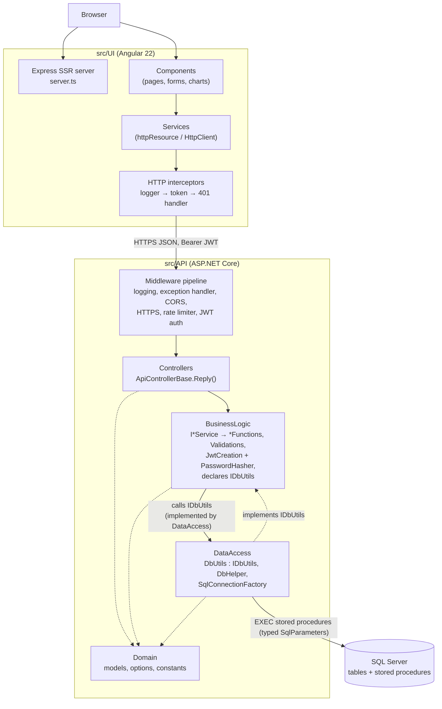
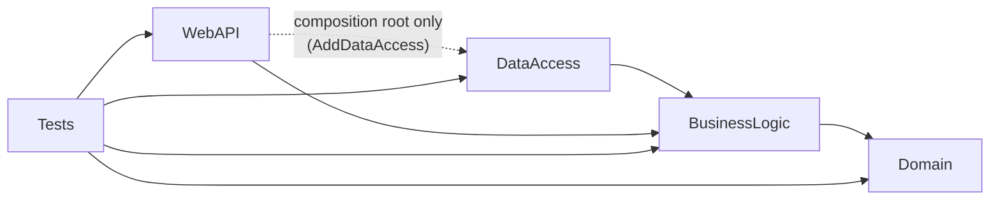
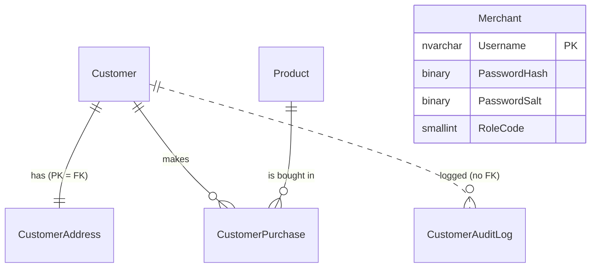

# Architecture & Design

> This document describes how the Customer Management System is actually built, derived from the source under `src/`. Where a statement is an interpretation rather than a fact visible in the code, it is worded as such. The `ai_docs/` folder holds shorter, task-oriented notes; where the two disagree, the source code is authoritative.

## Overview

The Customer Management System is a full-stack CRUD application in which a signed-in **merchant** manages **customers**, a **product** catalogue, **purchases**, and a customer **audit log**, and views a charts dashboard.

It is a three-tier **client–server** system:

| Tier | Location | Technology |
|---|---|---|
| UI | `src/UI/` | Angular 22 (standalone components, signals, Signal Forms, zoneless, SSR via `@angular/ssr` + Express) |
| API | `src/API/CustomerManagementSystemApi/` | ASP.NET Core (.NET 10) Web API, MVC controllers |
| DB | `src/DB/CustomerManagement/` | SQL Server, SSDT project (`Microsoft.Build.Sql`), deployed as a dacpac with `sqlpackage` |

The API is a **layered monolith organized along Clean Architecture lines**: four production projects whose compile-time references point inward — `Domain` (no dependencies) ← `BusinessLogic` (use cases plus the persistence abstraction it needs) ← `DataAccess` (SQL Server implementation). `WebAPI` is the outer HTTP layer and composition root. See [Clean Architecture refactoring](#clean-architecture-refactoring) for what changed from the earlier `WebAPI → BusinessLogic → DataAccess → Domain` chain. Data access is **stored-procedure-only** over raw ADO.NET (`Microsoft.Data.SqlClient`); there is no ORM. A significant share of business rules (customer lifecycle, uniqueness, stock) lives inside the T-SQL procedures, so the database is an active participant in the domain logic rather than a passive store.

The UI is a **single-page application with server-side rendering**: services own HTTP access and reactive state (Angular `httpResource`/signals); components bind to those signals.

## High-Level Architecture



Responsibilities:

- **UI** — rendering, routing, client-side validation, session token storage, optimistic local updates of loaded lists, all chart aggregation (the API sends raw per-customer rows; grouping happens in the browser).
- **WebAPI** — HTTP concerns only: routing, model binding, authentication/authorization, rate limiting, CORS, mapping `ResponseModel<T>` to HTTP responses / RFC 9457 Problem Details, OpenAPI.
- **BusinessLogic** — input validation, orchestration of a use case, audit-log writing, credential verification (PBKDF2) and JWT issuance; declares the persistence interface `IDbUtils` it depends on.
- **DataAccess** — implements `IDbUtils`: calling stored procedures, mapping `SqlDataReader` rows to domain models, connection selection.
- **Domain** — data shapes shared by every layer (records, request classes, enums) and column-length constants. It has no project or package references.
- **Database** — schema, constraints, and the transactional parts of business rules (lifecycle transitions, uniqueness, stock decrement).

There are no external services beyond SQL Server.

## Project Structure

```text
src/
├── API/
│   ├── CustomerManagementSystemApi/
│   │   ├── CustomerManagementSystem.WebAPI/        # host, controllers, middleware config
│   │   ├── CustomerManagementSystem.BusinessLogic/ # services, use-case classes, validation, JWT
│   │   ├── CustomerManagementSystem.DataAccess/    # ADO.NET gateway to stored procedures
│   │   ├── CustomerManagementSystem.Domain/        # models, options, constants (no dependencies)
│   │   ├── CustomerManagementSystem.Tests/         # xUnit v3 + Moq (unit and in-memory HTTP tests)
│   │   ├── Directory.Build.props / Directory.Packages.props
│   │   └── CustomerManagementSystem.slnx
│   └── Postman/                                    # manual API collection
├── DB/CustomerManagement/
│   ├── Tables/                                     # one CREATE TABLE per file
│   ├── StoredProcedures/                           # <Entity>_<Verb>.sql
│   └── Scripts/PostDeployment/                     # seed merchant + 50 products
└── UI/src/
    ├── app/components/   # one folder per page/widget (incl. charts/*)
    ├── app/services/     # API services, guards, interceptors, UI-state services
    ├── app/interfaces/   # TypeScript mirrors of API JSON
    ├── app/utils/        # pure helpers (error extraction, chart math, test-data generators)
    ├── app/pipes/        # RonPipe (currency)
    ├── environments/     # apiUrl + validation regexes
    ├── main.ts / main.server.ts / server.ts
    └── styles.css
```

### API projects

Project references (from the `.csproj` files):



| Project | Responsibility | Key types | Depends on | Used by |
|---|---|---|---|---|
| `WebAPI` | Composition root and HTTP edge | `Program.cs`, `ApiControllerBase`, controllers, `GlobalExceptionHandler`, `KebabCaseParameterTransformer`, `BearerSecuritySchemeTransformer` | BusinessLogic; DataAccess only so `Program.cs` can call `AddDataAccess()` | Tests |
| `BusinessLogic` | Use cases, validation, authentication, persistence abstraction | `I*Service` + implementations, `CustomerCreation`, `CustomerGetting`, `CustomerUpdating`, `CustomerActivation`, `CustomerDeletion`, `CustomerPurchasing`, `ProductFunctions`, `CustomerAuditLogger`, `CustomerCsvExporter`, `MerchantAuthData`, `JwtCreation`, `PasswordHasher`, `Validations/*`, `Abstractions/IDbUtils`, `Configuration/AuthOptions`, `BusinessLogicDependencyInjection` | Domain; packages `Microsoft.Extensions.{DependencyInjection.Abstractions, Logging.Abstractions, Options}`, `Microsoft.IdentityModel.JsonWebTokens` | WebAPI, DataAccess |
| `DataAccess` | SQL Server implementation of `IDbUtils` | `DbUtils`, `DbHelper`, `ISqlConnectionFactory`/`SqlConnectionFactory`, `SqlParameterExtensions`, `SqlDataReaderExtensions`, `Configuration/DatabaseOptions`, `DataAccessDependencyInjection` | BusinessLogic only (for `IDbUtils`; Domain types arrive transitively), `Microsoft.Data.SqlClient` | WebAPI (composition only) |
| `Domain` | Shared data contracts | models and request/response shapes (`CustomerModel`, `PagedResponse<T>`, `ResponseModel<T>`, …), enums, `FieldLengthConstants` | nothing | BusinessLogic (direct); DataAccess and WebAPI (transitively); Tests |

Build-wide settings in `Directory.Build.props`: `net10.0`, nullable enabled with nullable warnings as errors, `latest-recommended` analyzers, code style enforced on build, warnings as errors in CI. Package versions are centrally managed in `Directory.Packages.props`.

### Database project

`CustomerManagement.sqlproj` (SDK `Microsoft.Build.Sql`, target `SqlAzureV12`) declares six tables and 20 stored procedures. A post-deployment script `:r`-includes idempotent seed scripts. A nested `global.json` pins this project to the .NET 8 SDK.

### UI

All components are standalone and lazy-loaded per route. `services/` contains three kinds of things: API-facing data services (`CustomerService`, `ProductService`, `PurchaseService`, `AuditLogService`, `GlobalAuditLogService`, `CustomerInsightsService`, `UserLoginService`, `VerifyTokenService`, `HealthService`), cross-cutting HTTP/routing pieces (`authGuard`, `unsavedChangesGuard`, three interceptors, `AppTitleStrategy`), and UI-state singletons (`NotificationService`, `ConfirmDialogService`, `NavbarService`, `FooterService`, `SessionStorageService`, `ApiLoggerService`).

## Application/Data Flow

### Flow 1 — Editing a customer (write path)

```text
UpdateCustomerComponent (Signal Form submit)
 ↓ applyFormModel() → CustomerService.updateCustomer()
 ↓ HttpClient PATCH {apiUrl}/api/customer/update   (interceptors add Bearer token, log, catch 401)
 ↓ ASP.NET pipeline: HttpLogging → ExceptionHandler → CORS → HTTPS → RateLimiter → Authentication → Authorization
 ↓ CustomerController.UpdateCustomer([FromBody] UpdateCustomerRequest, Username from JWT)
 ↓ ICustomerService.UpdateCustomerAsync           (CustomerService: pure delegation)
 ↓ CustomerUpdating.UpdateCustomerAsync           (field validation → 400 ResponseModel on failure)
 ↓ IDbUtils.UpdateCustomerAsync → DbUtils.ExecuteStoredProcedureAsync("dbo.Customer_Update", …)
 ↓ dbo.Customer_Update                            (existence 404, enrollment-date 400, uniqueness 409, transactional UPDATE)
 ↑ SELECT Result, Message, Field  → DbHelper.HandleResponseWithMessageAsync → ResponseModel<object>
 ↑ CustomerUpdating: on 200, ICustomerAuditLogger.LogAsync(Edited, "Updated: …")  (best-effort, CancellationToken.None)
 ↑ ApiControllerBase.Reply(): <400 → JSON envelope; Field set → ValidationProblem; else → Problem
 ↑ CustomerService (UI): tap → updateCustomerLocally() + NotificationService toast
 ↑ On error: toServerErrors() maps ValidationProblem keys onto form fields
```

### Flow 2 — Paged customer list (read path)

```text
CustomerListComponent
  listParams = computed(page, pageSize=50, debounced searchTerm, sortColumn, sortDirection)
  constructor: customerService.bindCustomers(this.listParams)
 ↓ CustomerService.customersResource = httpResource(() => GET /api/customer/all?…)
   (re-fetches automatically whenever listParams changes; linkedSignal keeps the last page visible)
 ↓ CustomerController.GetCustomers([FromQuery] GetCustomersRequest)
 ↓ CustomerGetting.GetCustomersAsync  (page bounds 1..100, enum checks, trims search term)
 ↓ dbo.Customer_List  (result set 1: TotalCount; result set 2: page via OFFSET/FETCH, CASE-based ORDER BY)
 ↑ DbHelper.HandleResponseWithPagedCustomersAsync → PagedResponse<CustomerModel>
```

### Flow 3 — Login and authenticated navigation

```text
UserLoginComponent → UserLoginService.login() → POST /api/authentication/access-token
 ↓ [EnableRateLimiting("login")] fixed window: 5 / minute / IP
 ↓ AuthService (non-empty check) → JwtCreation.GenerateBearerJwtAsync
 ↓ JwtCreation.CheckCredentialsAsync (BusinessLogic)
     IDbUtils.GetMerchantAuthDataAsync → dbo.Merchant_GetAuthData
     PasswordHasher.VerifyPassword (PBKDF2-SHA256, constant-time compare, dummy hash/salt for unknown users)
     role check (403 if not 1801) → IDbUtils.RecordMerchantLoginAsync → dbo.Merchant_RecordLogin
 ↑ JWT (HMAC-SHA256; sub, unique_name, role, amr, jti; lifetime AccessTokenTimeoutMinutes)
UI: token → sessionStorage; navigate to /customers
Each guarded route: authGuard → VerifyTokenService → GET /api/authentication/verify-token
Any other 401: authErrorInterceptor clears session → /login?sessionExpired=true
```

### Flow 4 — Purchase

`CustomerDetailsComponent.recordPurchase()` → `PurchaseService.purchaseProduct()` → `POST /api/customer/purchase?customerId&productId[&purchasedAt]` → `CustomerPurchasing` (id and date checks) → `dbo.CustomerPurchase_Create`, which checks customer existence/status, test-only backdating, product existence, then atomically decrements `QuantityOnHand` (`WHERE QuantityOnHand > 0`) and inserts the purchase in one transaction. The audit entry is written afterwards with the product name returned by the procedure.

### Flow 5 — Charts

`ChartsComponent` reads `CustomerInsightsService` (`GET /api/customer/insights` → `dbo.Report_GetCustomerInsights`, two result sets: anonymous per-customer rows and monthly sales) and `ProductService.products`. All bucketing, ranking, and series building happens client-side in `charts/charts-data.ts` and `utils/chart-stats.ts`; the chart components render hand-built SVG.

## Layers and Responsibilities

| Layer | Responsibility | May depend on | Should not depend on | Representative code |
|---|---|---|---|---|
| UI components | Presentation, form state, user interaction | UI services, utils, interfaces | `HttpClient` directly (none do) | `customer-list.component.ts`, `update-customer.component.ts` |
| UI services | HTTP calls, reactive server state, local cache updates | `HttpClient`, `NotificationService`, `environment` | Components | `customer.service.ts`, `product.service.ts` |
| API controllers | HTTP mapping, identity extraction | `I*Service`, Domain models | DataAccess | `CustomerController`, `ApiControllerBase` |
| Business logic | Validation, orchestration, audit, credential check, token issuance; owns `IDbUtils` | Domain, `Microsoft.Extensions.*` abstractions | ASP.NET Core, SQL, DataAccess | `CustomerCreation`, `CustomerGetting`, `JwtCreation` |
| Data access | Implements `IDbUtils`: stored-procedure calls and row mapping | BusinessLogic abstractions (+ Domain types transitively), `Microsoft.Data.SqlClient` | WebAPI, business decisions | `DbUtils`, `DbHelper`, `SqlConnectionFactory` |
| Domain | Shared data shapes and constants | nothing | everything | `CustomerModel`, `ResponseModel<T>`, `FieldLengthConstants` |
| Database | Persistence, integrity, transactional rules | — | — | `Customer_Delete.sql`, `CustomerPurchase_Create.sql` |

How well the separation holds:

- **Held:** Controllers contain no business logic — every action is a one-line `Reply(await service.X(...))` except `ExportCustomers`, which only converts the CSV string to a file result. No controller references DataAccess types. Domain has no dependencies at all.
- **Held (enforced by project references):** BusinessLogic references only Domain and a few `Microsoft.Extensions.*` abstraction packages — no ASP.NET Core framework, no SQL client, no DataAccess. DataAccess references only BusinessLogic, whose interface it implements; it uses Domain types transitively and has no direct Domain reference.
- **Partially held:** every business method still returns HTTP-style status codes inside `ResponseModel<T>` (see Technical Debt). The codes are plain integers, so no framework dependency is involved, but the vocabulary is HTTP's.
- **Shared with the database:** Customer lifecycle rules (only deactivated/test customers can be deleted; deactivated customers cannot purchase; only test customers can have backdated purchases; enrollment date ≤ account creation) are enforced only in T-SQL, while field-format rules are enforced only in C# (and duplicated in the UI). Neither layer alone holds the full rule set.

## Design Patterns

### Layered architecture with compile-time boundaries

- **Where:** the four API projects.
- **How:** `.csproj` references point inward: `BusinessLogic → Domain`, `DataAccess → BusinessLogic`, `WebAPI → BusinessLogic` (+ `DataAccess` for composition). Controllers only see `I*Service` interfaces. WebAPI has no direct Domain reference: its controllers use Domain types (request models, `ResponseModel<T>`) through BusinessLogic's transitive reference.
- **Problem solved:** business rules compile without any HTTP or SQL dependency, and the database technology is a plug-in behind `IDbUtils`.

### Service layer / Facade over use-case classes

- **Where:** `Services/Implementation/CustomerService.cs`, `ProductService.cs`, `AuthService.cs`.
- **How:** `CustomerService` implements the 14-method `ICustomerService` by delegating each call, unchanged, to one of six concrete use-case classes (`CustomerCreation`, `CustomerGetting`, `CustomerUpdating`, `CustomerActivation`, `CustomerDeletion`, `CustomerPurchasing`). `ProductService` does the same over `ProductFunctions`.
- **Why it appears to be used:** controllers depend on one interface per area while the logic is split into smaller per-action classes. In practice the façade adds no behavior; it is a pure pass-through.

### Gateway (repository-like data access)

- **Where:** `IDbUtils` (declared in `BusinessLogic/Abstractions`) / `DbUtils` (DataAccess).
- **How:** one interface exposes 19 methods (roughly one per stored procedure; the credential check calls two) across all entities (customers, merchants, audit log, products, purchases, reports). Each method returns domain models wrapped in `ResponseModel<T>`.
- **Classification:** this is closer to a *Table Data Gateway / database gateway* than to a per-aggregate Repository: it is not organized around aggregates, it has no collection-like semantics, and it exposes reporting queries alongside CRUD. It does provide the key repository benefit — business logic depends on an interface that tests replace with `Mock<IDbUtils>`.

### Execute-Around (template via delegates)

- **Where:** `DbUtils.ExecuteStoredProcedureAsync<T>(procName, Action<SqlCommand>? configure, Func<SqlDataReader, Task<T>> handle, ct)`.
- **How:** connection opening, command creation, `CommandType.StoredProcedure`, reader execution, and disposal are fixed; each caller supplies only parameter setup and result mapping (usually a `DbHelper.HandleResponseWith…Async` function).
- **Problem solved:** removes ADO.NET boilerplate from every data-access method and guarantees disposal.

### Factory

- **Where:** `ISqlConnectionFactory` / `SqlConnectionFactory.OpenConnectionAsync`, and the small static factory `JwtSigningKey.Create`.
- **How:** `SqlConnectionFactory` hides which connection string is used. On first use (`Lazy<Task<string>>`), on Windows it probes the Docker connection string and falls back to `LocalSqlServer` if unreachable; elsewhere it always uses Docker. It returns an already-open connection. An `internal` constructor accepts an `isWindows` flag and a `canConnect` delegate so tests can drive the choice.
- **Problem solved:** centralizes environment-dependent connection selection and makes it testable. `JwtSigningKey.Create` ensures the API's token validation and `JwtCreation`'s signing use the same key derivation.

### Result object (status envelope)

- **Where:** `Domain/Models/ResponseModel<T>` (`Status`, `ResponseMessage`, `Data`, `[JsonIgnore] Field`).
- **How:** every BusinessLogic and DataAccess method returns a `ResponseModel<T>` instead of throwing for expected failures. Stored procedures return a matching `(Result, Message[, Field])` row where `Result = 0` means success and any other value is an HTTP status. `ApiControllerBase.Reply<T>()` turns it into a 2xx JSON body, a `ProblemDetails`, or a `ValidationProblemDetails` keyed by the camel-cased `Field`.
- **Problem solved:** expected failures travel as values, keeping exceptions for genuinely unexpected errors. The trade-off is that HTTP semantics are embedded in every layer (see Technical Debt).

### Data Mapper (hand-written)

- **Where:** `DbHelper.Map…FromReader` methods and the typed reader extensions in `SqlExtensions.cs`; on the UI side, `customer-form.ts` (`toFormModel`, `toCreateCustomerRequest`, `applyFormModel`) and `product-form.ts` (`toProduct`).
- **How:** explicit, column-name-based mapping between `SqlDataReader` rows and domain records, and between API shapes and form models.

### Options pattern with startup validation

- **Where:** `Program.cs` binds `AuthOptions` (`Auth` section) and `DatabaseOptions` (`ConnectionStrings` section) with `ValidateDataAnnotations().ValidateOnStart()`; the classes carry `[Required]`, `[MinLength(32)]`, `[Range(1,1440)]`.
- **Problem solved:** a missing or weak JWT key or missing connection string fails at startup instead of on first request (covered by `StartupValidationTests`).

### Pipeline / Chain of Responsibility

- **API:** the ASP.NET Core middleware pipeline in `Program.cs` (HTTP logging → exception handler → status-code pages → HSTS/Swagger → `Cache-Control: no-store` inline middleware → CORS → HTTPS redirection → rate limiter → authentication → authorization → endpoints).
- **UI:** functional `HttpInterceptorFn`s registered in order in `app.config.ts`: `apiLoggerInterceptor` → `authTokenInterceptor` → `authErrorInterceptor`.

### Strategy (framework extension points)

- **Where:** `AppTitleStrategy extends TitleStrategy` (provided via `{ provide: TitleStrategy, useClass: AppTitleStrategy }`), `KebabCaseParameterTransformer : IOutboundParameterTransformer`, `BearerSecuritySchemeTransformer : IOpenApiDocumentTransformer`, `GlobalExceptionHandler : IExceptionHandler`.
- **Classification:** these are implementations of strategy-style hooks defined by Angular and ASP.NET Core rather than strategies the application defines itself.

### Observer / reactive state (UI)

- **Where:** all UI services. Server state is held in `httpResource` (and `rxResource` in components); derived state is `computed`; "keep the previous value while loading" uses `linkedSignal`.
- **Notable idiom:** services expose `bindX(params: () => P | undefined)`. A component passes a signal/getter (e.g. `CustomerListComponent.listParams`), and the service's resource re-requests whenever that signal changes. Root singletons thus follow whichever component last bound them.

### Promise-based dialog service

- **Where:** `ConfirmDialogService.confirm()` returns a `Promise<boolean>` resolved by `ConfirmDialogComponent` (mounted once in `app.html`). It is used directly by components and by `unsavedChangesGuard` (a `CanDeactivateFn` can return a `Promise`).
- **Problem solved:** replaces `window.confirm` with an accessible, styled dialog while keeping call sites linear (`if (!(await confirm(...))) return;`).

### Patterns not present

There is no ORM/Unit of Work, no CQRS or MediatR, no domain events, no explicit Repository per aggregate, and no state-management library (NgRx etc.) in the UI.

## Design Principles

### Single Responsibility Principle

- **Followed:** BusinessLogic splits the customer area into per-action classes (`CustomerCreation`, `CustomerUpdating`, …). `CustomerCsvExporter` only formats CSV (with formula-injection escaping). `CustomerAuditLogger` only writes audit entries. `SqlConnectionFactory` only chooses and opens connections. On the UI, `extractErrorMessage` and `toServerErrors` each handle one concern.
- **Not followed:** `JwtCreation` now both verifies credentials and issues the token (the credential check was moved out of `DbUtils`, which had mixed it with data access; keeping it next to token issuance was the smallest correct home). `CustomerGetting` handles single lookup, paged list, CSV export, audit-log reads, purchase reads, and insights. The UI `CustomerService` (~380 lines) holds list state, activation state, export state, DOM-based file download, retry policy, and toast notifications.

### Open/Closed Principle

- Adding an endpoint requires editing `IDbUtils`, `DbUtils`, `DbHelper`, an `I*Service`, its implementation, a `*Functions` class, a controller, and usually a stored procedure. The code is not structured for extension without modification; this is typical of the chosen layering rather than a specific defect.

### Liskov Substitution Principle

- Not meaningfully exercised: inheritance is limited to `ApiControllerBase : ControllerBase` and `AppTitleStrategy : TitleStrategy`, both used as intended by their frameworks.

### Interface Segregation Principle

- **Not followed for data access:** `IDbUtils` is a single 19-method interface used by every BusinessLogic class, even though each class needs only 1–4 methods (e.g. `CustomerDeletion` uses two). Tests compensate by mocking only the methods a test needs.
- **Followed elsewhere:** `ICustomerAuditLogger` has one method; `ISqlConnectionFactory` has one method; `IAuthService` has one method.

### Dependency Inversion Principle

- **Followed:** controllers depend on `I*Service`; use-case classes depend on `IDbUtils` and `ICustomerAuditLogger`; `DbUtils` depends on `ISqlConnectionFactory`. `IDbUtils` is owned by BusinessLogic (the consumer) and implemented by DataAccess, so the high-level policy does not depend on the low-level SQL module.
- **Partially followed:** the use-case classes themselves are concrete and injected as concrete types; only the service façades have interfaces. This is acceptable because nothing needs to substitute them.

### DRY

- **Followed:** `DbHelper.AddCustomerCoreParameters` / `AddAddressParameters` share parameter setup between create and update; `ExecuteStoredProcedureAsync` removes ADO.NET repetition; `customer-form.ts` and `CustomerFormFieldsComponent` are shared by the create and edit pages; `FieldLengthConstants` is the single C# source for column sizes used by both validation and `SqlParameter` sizes.
- **Not followed:**
  - Validation regexes exist in both `BusinessLogic/Constants/RegexConstants.cs` and `UI/src/environments/environment.ts`.
  - Column lengths exist in table DDL, procedure parameters, and `FieldLengthConstants` (the `ai_docs` explicitly note "the four places a column lives").
  - `dbo.Customer_Get` repeats the same 17-column `SELECT … JOIN` three times (one per lookup key); `dbo.Customer_List` repeats its `WHERE` clause for the count and page queries.
  - The `HandleResponseWith…Async` methods in `DbHelper` repeat the same `Result`/`Message` reading logic three times.
  - The username-presence check exists in both `AuthService` and `JwtCreation`.
  - Per `ai_docs/index.md`, several UI files (notification, confirm dialog, chart utilities, etc.) are intentionally copied byte-for-byte across sibling repositories rather than shared as a package.

### KISS / YAGNI

- The stack avoids ORMs, mediators, and state libraries; data access is direct ADO.NET with typed parameters. Charts are hand-built SVG rather than a charting dependency. Sorting is a closed `CASE` list rather than dynamic SQL. These choices keep the moving parts few.
- The `I*Service` façade layer is the main place where an abstraction exists without adding behavior.

### Separation of Concerns

- Clear at the HTTP edge (controllers vs. logic) and in the UI (components never call `HttpClient`).
- Blurred across tiers for business rules and status semantics (see Layers and Technical Debt).
- UI data services also trigger UI side effects (`NotificationService.show(...)` inside `tap`), coupling data access to presentation feedback. The `…Silently` method variants exist to opt out of this for bulk operations.

### Encapsulation

- Domain read models are immutable `sealed record`s with `required init` properties; `PagedResponse<T>` is read-only.
- Request classes (`CreateCustomerRequest`, `GetCustomersRequest`, …) are mutable `set` classes for model binding, and `CustomerGetting.ValidateAndNormalizeSortAndSearch` mutates the incoming request (`request.SearchTerm = …`).
- UI services expose `asReadonly()` signals (`NotificationService`, `ConfirmDialogService`, `NavbarService`) and keep resources private.
- The domain model is anemic: entities carry no behavior; all rules are in BusinessLogic or T-SQL.

### Composition over inheritance

- Followed throughout. Use-case classes are composed into services via constructor injection; UI components compose child components (`CustomerFormFieldsComponent`, chart components). The only application-defined base class is `ApiControllerBase`, used for a single shared helper.

### Law of Demeter

- Generally followed. Components read service signals directly (`readonly customers = this.customerService.customers`) instead of reaching through objects.

## Dependency Injection and Dependency Management

### API

- **Container:** the built-in `Microsoft.Extensions.DependencyInjection` container.
- **Style:** constructor injection everywhere, mostly via C# primary constructors (`public class CustomerCreation(IDbUtils dbUtils, ICustomerAuditLogger auditLogger)`).
- **Composition root:** `Program.cs` registers framework services and options, then calls `AddBusinessLogic()` (`BusinessLogicDependencyInjection.cs`, BusinessLogic types only) and `AddDataAccess()` (`DataAccessDependencyInjection.cs`, the SQL implementations):

| Registration | Lifetime |
|---|---|
| `IAuthService`, `ICustomerService`, `IProductService`, `ICustomerAuditLogger` | Scoped |
| `CustomerCreation`, `CustomerGetting`, `CustomerUpdating`, `CustomerActivation`, `CustomerDeletion`, `CustomerPurchasing`, `ProductFunctions` | Scoped (concrete) |
| `ISqlConnectionFactory → SqlConnectionFactory` (via `AddDataAccess`) | Singleton |
| `IDbUtils → DbUtils` (via `AddDataAccess`) | Singleton |
| `JwtCreation` | Singleton |

- **Notes:**
  - Each project registers its own types. WebAPI is the only place that knows both BusinessLogic and DataAccess, which is the composition root's job.
  - `DbUtils` and `JwtCreation` are stateless apart from injected singletons, so singleton lifetime is safe. `SqlConnectionFactory`'s lazily chosen connection string is cached for the process lifetime.
  - Options are injected as `IOptions<T>`. `JwtBearerOptions` are configured via `AddOptions<JwtBearerOptions>().Configure<IOptions<AuthOptions>>(…)` so the bearer handler and `JwtCreation` read the same `AuthOptions`.
- **Direct instantiation:** `new SqlCommand`, `new SqlConnection`, `new JsonWebTokenHandler()` (in `JwtCreation`), and static helpers (`DbHelper`, `PasswordHasher` in BusinessLogic, `CustomerCsvExporter`, `*Validation`) are used without DI. These are stateless or framework primitives.

### UI

- **Container:** Angular's hierarchical injector. Every service is `@Injectable({ providedIn: 'root' })` (application-wide singletons). Interceptors and guards are functions that call `inject()`.
- **Style:** `inject()` field initializers; no constructor injection.
- **Composition:** `app.config.ts` (browser) and `app.config.server.ts` (merges `provideServerRendering(withRoutes(serverRoutes))`). The only component-level provider is `providers: [RonPipe]` in `ChartsComponent`, so it can call the pipe's `transform` from TypeScript.
- **Configuration dependency:** services read `environment.apiUrl` directly at field initialization rather than through an injection token.

## UI Architecture

### Framework and bootstrap

- Angular 22, standalone components, no `NgModule`s, no `zone.js` (zoneless change detection is the default).
- `main.ts` bootstraps `App` with `appConfig`; `main.server.ts` + `server.ts` provide SSR via `AngularNodeAppEngine` on Express.
- `app.routes.server.ts`: routes with an id (`customers/:customerId`, `customers/update/:customerId`, `products/:productId`) are server-rendered per request; all others are prerendered.
- `provideClientHydration(withEventReplay(), withNoIncrementalHydration())`.

### Shell

`App` (`app.ts` / `app.html`) renders the navbar, a `<main>` with the router outlet, footer, and two global overlays: `<app-notification>` (toasts) and `<app-confirm-dialog>`. In the browser, it polls `HealthService.pollApiHealth()` every 15 s and replaces the router outlet with an "API is not running" card when `/health` fails. After each navigation it focuses the page's `<h1>` for accessibility.

### Component organization

- **Pages:** `home` (wraps `customer-list`), `customer-details`, `create-customer`, `update-customer`, `products`, `product-details`, `create-product`, `charts`, `global-audit-log`, `about` (API-logging toggle and test-data generator), `user-login`, `page-not-found`.
- **Reusable form fragments:** `customer-form-fields` (+ `customer-form.ts` schema/mappers), `create-product/product-form-fields` (+ `product-form.ts`).
- **Charts:** `charts/` with presentational children `time-series-chart`, `donut-chart`, `kpi-tile`, `ranked-bar-chart`, `stock-health-chart`; pure data transforms in `charts-data.ts` and `utils/chart-stats.ts`, geometry in `utils/chart-geometry.ts` / `chart-scale.ts`.
- **Global widgets:** `navigation-bar`, `footer`, `notification`, `confirm-dialog`.

### State management

No store library. State lives in signals:

- **Server state:** in root services as `httpResource`s (`CustomerService.customersResource`, `ProductService.productsResource`, `AuditLogService`, `PurchaseService`, `GlobalAuditLogService`, `CustomerInsightsService`), or in components as `rxResource`s keyed on a route input (`CustomerDetailsComponent`, `UpdateCustomerComponent`, `ProductDetailsComponent`).
- **Lazy loading of root resources:** resources start idle; `loadX()` flips a `requested` signal (`ProductService`, `CustomerInsightsService`) or `bindX(getter)` supplies params (`CustomerService`, `AuditLogService`, `PurchaseService`, `GlobalAuditLogService`).
- **Local mutation after writes:** `CustomerService.updateLoadedPage()` edits the `linkedSignal` page in place after update/deactivate/delete, avoiding a refetch.
- **UI state:** `NavbarService`/`FooterService` visibility flags (toggled by the login page), `NotificationService` toast list, `ConfirmDialogService` dialog state, `ApiLoggerService` toggle persisted in `localStorage`.
- **Session:** the JWT is kept in `sessionStorage` via `SessionStorageService` (guarded for SSR with `typeof window` checks).

### Communication with the API

- `HttpClient` with `withFetch()`. All URLs are built from `environment.apiUrl` (`https://localhost:7145`).
- Response bodies are typed as `GenericResponse<T>` (`status`, `responseMessage`, `data`), mirroring `ResponseModel<T>`. `interfaces/` mirrors the API's camelCase JSON.
- Retry: only `CustomerService.changeStatus` (deactivate/reactivate) retries, up to 3 times with linear back-off, and only for status 0 or ≥ 500.
- CSV export downloads a `Blob` and triggers a synthetic `<a download>` click; error blobs are parsed back to JSON to extract Problem Details.

### Routing and navigation

- `app.routes.ts`: every route is lazy (`loadComponent`) and titled; `AppTitleStrategy` appends the app name.
- `authGuard` (`CanActivateFn`) on every route except `login` and `**`. It makes a `GET /verify-token` call on every guarded navigation.
- `unsavedChangesGuard` (`CanDeactivateFn<HasUnsavedChanges>`) on the create/edit pages, plus `window:beforeunload` host listeners.
- `withComponentInputBinding()` binds route params and query params to signal inputs (`customerId = input<string>()`, `sessionExpired = input<string>()`).

### Forms and validation

- Angular **Signal Forms** (`@angular/forms/signals`): `form(modelSignal, schema, { submission: { action, onInvalid } })`, `[formField]`, `[formRoot]`. No reactive or template-driven forms.
- Schemas (`customerFormSchema`, `productFormSchema`) declare `required`, `pattern`, and custom `validate` rules (e.g., no future dates).
- Server-side validation errors are merged into the form: `toServerErrors()` maps `ValidationProblemDetails.errors` keys to form fields (case-insensitive, falling back to the last path segment) and returns them from the submission action; unmatched messages go to a page-level `saveError`.
- The client schema is stricter than the API in places (e.g., it requires gender and birth date; the API treats both as optional).

### Error and loading states

- Each resource exposes `loading` (`isLoading`) and `error` (mapped through `extractErrorMessage`, which reads Problem Details `errors` → `detail` → `title`, and gives a specific message for status 0).
- Page-load failures render an alert in place of the content; action failures render an inline `role="alert"`; successes show a toast from the service.
- `authErrorInterceptor` handles 401s globally (except on `/api/authentication/` calls).
- `provideBrowserGlobalErrorListeners()` is enabled; there is no custom `ErrorHandler`.

## API Architecture

### Endpoint organization

Three attribute-routed controllers under `api/[controller]`, with a `KebabCaseParameterTransformer` route convention (so `ProductController` → `/api/product`, action routes are explicit strings):

| Controller | Auth | Endpoints |
|---|---|---|
| `AuthenticationController` | mixed | `POST access-token` (anonymous, rate-limited), `GET verify-token` (`[Authorize]`) |
| `CustomerController` | `[Authorize]` | `POST create`, `GET get`, `GET all`, `GET export`, `GET audit-log`, `GET audit-log/all`, `GET insights`, `GET purchases`, `POST purchase`, `PATCH update`, `PATCH deactivate`, `PATCH reactivate`, `DELETE delete`, `DELETE audit-log/all` (`[Authorize(Roles = "1801")]`) |
| `ProductController` | `[Authorize]` | `GET all`, `GET get`, `POST create`, `POST reset-stock` |

The routes are RPC-style (verbs in paths, ids in query strings) rather than resource-oriented REST. `/health` is mapped with `MapHealthChecks` (no database check is registered).

### Request flow

```text
Kestrel
 → UseHttpLogging (method, path, status, duration; combined log line)
 → UseExceptionHandler (→ GlobalExceptionHandler)
 → UseStatusCodePages
 → [Development] MapOpenApi + Swagger UI   |  [other] UseHsts
 → inline middleware: Cache-Control: no-store
 → UseCors (default policy: configured origins; GET/POST/PATCH/DELETE; Content-Type, Authorization)
 → UseHttpsRedirection
 → UseRateLimiter ("login" policy only)
 → UseAuthentication (JwtBearer) → UseAuthorization
 → MapControllers → [ApiController] model binding → action
 → I*Service → use-case class → IDbUtils → stored procedure
 ← ResponseModel<T> → ApiControllerBase.Reply()
```

### Request/response models

- Request DTOs are mutable classes with nullable properties (`CreateCustomerRequest`, `UpdateCustomerRequest`, `CreateProductRequest`, `MerchantCredentials`, `GetCustomersRequest`, `ExportCustomersRequest`). Nullable-everything makes "field omitted" representable for the partial update (`UpdateCustomerRequest`, mirrored by `ISNULL(@x, column)` in `Customer_Update`) and moves required-field checking into BusinessLogic.
- Responses are `ResponseModel<T>` envelopes on success; failures are `application/problem+json`.
- Serialization: default System.Text.Json (camelCase). `AuditAction` is serialized as a string via `[JsonConverter(typeof(JsonStringEnumConverter<AuditAction>))]`; other enums are numeric (e.g., `CustomerStatus` 1901/1903/1904). `ResponseModel.Field` is `[JsonIgnore]`.

### Validation

- `[ApiController]` automatic model-state validation handles binding failures (e.g., malformed JSON, invalid GUID).
- Business validation is imperative code in the use-case classes and static `Validations/*` helpers (`AddressValidation`, `EmailValidation`, `PhoneNumberValidation` using `[GeneratedRegex]`), returning the first error as a 400 `ResponseModel`. These 400s have no `Field`, so they reach the client as plain Problem Details.
- Database-detected conflicts (409 duplicate email/phone, 400 enrollment date) set `Field`, so they reach the client as `ValidationProblemDetails` keyed by property and appear next to the form field.

### Authentication and authorization

- JWT bearer (`AddJwtBearer`), validating signing key, issuer, audience, and lifetime with `ClockSkew = TimeSpan.Zero`. Tokens are issued by `JwtCreation` with HMAC-SHA256 and a `role` claim containing the numeric role code.
- `CustomerController` and `ProductController` are `[Authorize]` at class level; only `access-token` is anonymous (asserted by `EndpointAuthorizationTests`, which enumerates every endpoint).
- The only role-gated endpoint is `DELETE audit-log/all` (`Roles = "1801"`). Because login itself rejects any role other than `1801`, every valid token already carries that role.
- The acting user for audit entries is `User.Identity!.Name!` (from `unique_name`).

### Error handling

See [Error Handling](#error-handling).

### Business-logic boundaries

Controllers → `I*Service` (façade) → concrete use-case classes. The use-case classes are where validation and orchestration live; the façades contain no logic. Some rules sit below the API in stored procedures.

## Database Architecture

### Technology and deployment

- SQL Server (Azure SQL Edge container `sqlserver` on port 1433 for local development, per `run.sh`; optional local SQL Server fallback on Windows via `ConnectionStrings:LocalSqlServer`).
- Schema is declarative (SSDT). `run.sh` builds the `.dacpac` and publishes it with `sqlpackage /Action:Publish /p:BlockOnPossibleDataLoss=false`, retrying until the server accepts connections. There are **no migration scripts**; schema drift is resolved by dacpac diffing.
- Seeding: `PostDeployment.sql` includes `Seed_Merchant.sql` (one merchant, `TestMerchantID`, with a pre-computed PBKDF2 hash and salt) and `Seed_Product.sql` (50 products with fixed GUIDs, inserted `WHERE NOT EXISTS`, so redeploys do not reset stock).

### Schema



| Table | Key | Notable constraints |
|---|---|---|
| `Customer` | `CustomerId UNIQUEIDENTIFIER DEFAULT NEWSEQUENTIALID()` | `UQ` on `Email` and `PhoneNumber`; `CK` on `Gender` (0/1/2), `StatusCode` (1901/1903/1904), `StatusCodeBeforeDeactivation` (1901/1904); index on `(LastName, FirstName)` |
| `CustomerAddress` | `CustomerId` (PK and FK) | strict 1:1 with `Customer` |
| `CustomerPurchase` | `CustomerPurchaseId INT IDENTITY` | FKs to `Customer` and `Product`; indexes on `(CustomerId, PurchasedAt DESC, Id DESC)` and `(ProductId, …)` |
| `Product` | `ProductId UNIQUEIDENTIFIER` | `CK` `Price >= 0`, `QuantityOnHand >= 0`, `QuantityOnHand <= InitialQuantity` |
| `CustomerAuditLog` | `CustomerAuditLogId INT IDENTITY` | `CK` on `ActionType`; **no FK** to `Customer`, so history survives deletion |
| `Merchant` | `Username` | — |

Conventions visible in the DDL: singular PascalCase table names, `<Table>Id` keys, all constraints explicitly named (`PK_`, `FK_`, `UQ_`, `CK_`, `DF_`, `IX_`), UTC `DATETIME2(3)` for `…At` columns written with `SYSUTCDATETIME()`, `DATE` for `…Date` columns.

### Data access

- **Stored procedures only.** `DbUtils` never sends ad-hoc SQL. Procedures are named `<Entity>_<Verb>` (`Customer_Create`, `CustomerPurchase_Create`, `Report_GetCustomerInsights`).
- **Typed parameters:** `SqlParameterExtensions` (`AddNVarChar(name, size, value)`, `AddVarChar`, `AddDate`, `AddDateTime2` with scale 3, `AddDecimal(precision, scale)`) give every parameter its exact column type and length, which avoids implicit conversions on indexed `VARCHAR` columns.
- **Mapping:** `SqlDataReaderExtensions` read by column name; `GetUtcDateTime` stamps `DateTimeKind.Utc`; `GetOptionalString("Field")` tolerates procedures that don't return a `Field` column.
- **Multiple result sets:** `Customer_List` and `CustomerAuditLog_List` return a total count then a page; `Product_GetDetails` returns the product then its buyers; `Report_GetCustomerInsights` returns customers then monthly sales.
- **Result contract:** mutating procedures end with `SELECT @Result AS Result, @Message AS Message[, @Field AS Field][, extra columns]`. `Result = 0` is success; non-zero values are HTTP status codes (400/404/409). `DbHelper.HandleResponseWithMessageAsync` throws `InvalidOperationException` if no row comes back.

### Transactions and concurrency

- Transactions are managed **inside procedures**, never from C#. Every procedure starts with `SET NOCOUNT ON; SET XACT_ABORT ON;`. Multi-statement writes (`Customer_Create`, `Customer_Update`, `Customer_Delete`, `CustomerPurchase_Create`) use `BEGIN TRY / BEGIN TRANSACTION / COMMIT` with `ROLLBACK` + `THROW` in `CATCH`.
- Uniqueness is pre-checked (to return a field-specific 409) and also caught from constraint violations 2601/2627 to cover the race window.
- Stock is decremented with a guarded `UPDATE … WHERE QuantityOnHand > 0` and `@@ROWCOUNT` check, which prevents overselling without explicit locking hints.
- The audit-log write is a **separate** procedure call on a separate connection after the main change commits; it is not part of the business transaction.

### Business rules in the database

- Lifecycle: `Customer_Deactivate` saves the prior status into `StatusCodeBeforeDeactivation`; `Customer_Reactivate` restores it (so a Test customer stays Test); `Customer_Delete` requires status 1903 or 1904 and deletes purchases, address, and customer in one transaction (stock is not restored).
- Purchases: deactivated customers cannot buy (409); only test customers may have a backdated `@PurchasedAt`, which must not precede `EnrollmentDate` (400).
- `Customer_Update` rejects an `EnrollmentDate` after `AccountCreatedAt` (400).

### Connection management and caching

- `SqlConnectionFactory` opens a new pooled `SqlConnection` per procedure call (ADO.NET pooling applies); each `ExecuteStoredProcedureAsync` disposes its connection.
- There is no application-level caching on the API. On the UI, `httpResource` values act as a per-session cache until reloaded.

## Error Handling

### Database

Expected outcomes are returned as `(Result, Message)` rows. Unexpected SQL errors are re-thrown with `THROW` after rollback; no procedure returns `ERROR_MESSAGE()` to the caller.

### Data access and business logic

- Expected failures are values (`ResponseModel<T>` with status 400/401/403/404/409). Validation stops at the first failing rule.
- Exceptions (SQL errors, a missing result row) propagate unhandled up to the ASP.NET pipeline.
- `CustomerAuditLogger.LogAsync` catches **all** exceptions and logs them (`[LoggerMessage]` event 2) so an audit failure never fails the user's already-committed change. Callers pass `CancellationToken.None` so a client disconnect does not skip the audit write.

### API

- `ApiControllerBase.Reply()` converts non-success `ResponseModel`s to `Problem(...)` or `ValidationProblem(...)`.
- `GlobalExceptionHandler` (registered with `AddExceptionHandler` + `AddProblemDetails`):
  - If the client aborted the request → status 499, logged at Debug.
  - Otherwise → logs at Error and writes a 500 Problem Details; `detail` contains the exception message **only in Development**.
- `UseStatusCodePages` gives empty error responses (e.g., 401/403 from the auth middleware, 404 for unknown routes) a Problem Details body.
- The rate limiter's `OnRejected` writes a 429 Problem Details with a `Retry-After` header.

### Logging

- `Microsoft.Extensions.Logging` with source-generated `[LoggerMessage]` methods (`GlobalExceptionHandler`, `CustomerAuditLogger`, `SqlConnectionFactory`).
- Console logger: JSON format with UTC timestamps and scopes in `appsettings.json`; single-line simple format in `appsettings.Development.json`.
- HTTP request logging via `AddHttpLogging` (method, path, status, duration only — no bodies or headers); `/health` is excluded.

### UI

- Per-resource `error` signals; `extractErrorMessage` normalizes Problem Details and network failures.
- `toServerErrors` attaches server validation errors to Signal Form fields.
- Global 401 handling in `authErrorInterceptor`; the API-down state is surfaced by the health poll.
- `apiLoggerInterceptor` logs requests/responses to the browser console (redacting `password` and `accessToken`) when enabled.
- Retry with back-off only for activation changes (transient errors only).

## Configuration

| Source | Content |
|---|---|
| `WebAPI/appsettings.json` | `ConnectionStrings:Docker` and `:LocalSqlServer`, `Auth` (`SecureJwtKey`, `JwtIssuer`, `JwtAudience`, `AccessTokenTimeoutMinutes`), `Cors:AllowedOrigins`, `https_port`, logging |
| `WebAPI/appsettings.Development.json` | console formatter override |
| `WebAPI/Properties/launchSettings.json` | `https` profile on `https://localhost:7145` |
| User secrets | `UserSecretsId` is set in `WebAPI.csproj`, so secrets can override `appsettings.json` locally |
| Environment variables | standard ASP.NET Core binding (e.g., `run.sh` sets `ConnectionStrings__Docker` and `ASPNETCORE_ENVIRONMENT=Development`) |
| `UI/src/environments/environment.ts` | `apiUrl` and the email/phone/username regexes — a single file, no per-environment variants or file replacements |
| `run.sh` variables | `SQL_IMAGE`, `SQL_CONTAINER_NAME`, `SQL_SA_PASSWORD`, `SQL_PORT`, `SQL_PLATFORM`, `SQL_DATABASE`, `API_URL` |
| `global.json` (root) | .NET SDK 10.0.x and Microsoft Testing Platform runner; `src/DB/CustomerManagement/global.json` pins .NET 8 SDK for the SQL project |

- **Validation:** `AuthOptions` and `DatabaseOptions` are validated at startup (`ValidateOnStart`).
- **Secrets:** `appsettings.json` is committed with a development connection string (including an SA password for the local container) and a placeholder JWT key. The `ai_docs` describe the committed key as a placeholder; production secret management is not implemented in the repository.
- **Environment-specific behavior:** OpenAPI/Swagger only in Development; HSTS only outside Development; exception detail only in Development; the UI's API logging defaults on in Angular dev mode.
- **Feature flags:** none, other than the UI's API-logging toggle stored in `localStorage`.

## Security

- **Authentication:** username/password → short-lived JWT (default 15 minutes, configurable 1–1440). No refresh tokens and no server-side revocation; logout only clears `sessionStorage`.
- **Password storage:** PBKDF2 (`Rfc2898DeriveBytes.Pbkdf2`, SHA-256, 100,000 iterations, 16-byte salt, 32-byte hash) with `CryptographicOperations.FixedTimeEquals`. Unknown usernames are verified against a dummy hash so response timing does not reveal whether a username exists.
- **Brute-force mitigation:** fixed-window rate limiter on `access-token` (5 requests/minute per remote IP).
- **Authorization:** all business endpoints require a valid token; a single role exists, so authorization is effectively "authenticated or not".
- **Token storage (UI):** `sessionStorage`, which is readable by any script on the origin (an XSS exposure inherent to this choice). The interceptor only attaches the token to requests whose URL starts with `environment.apiUrl`.
- **SQL injection:** all access is through stored procedures with typed parameters; `Customer_List` escapes `LIKE` wildcards and uses a fixed `CASE` list for sorting instead of dynamic SQL.
- **CSV injection:** `CustomerCsvExporter.EscapeField` prefixes values starting with `=`, `+`, `-`, `@` with `'`.
- **CORS:** explicit origin allow-list from configuration; methods and headers restricted. No cookies are used, so CSRF does not apply to the bearer-token API.
- **Transport:** HTTPS redirection; HSTS outside Development; `Cache-Control: no-store` on all API responses.
- **Error disclosure:** exception messages are hidden outside Development. The 403 message on login includes the numeric role code.
- **Not present:** account lockout, MFA, audit of failed logins, security headers beyond HSTS/no-store, CSP on the SSR server.

## Testing Architecture

### API (`CustomerManagementSystem.Tests`)

- **Framework:** xUnit v3 on Microsoft Testing Platform, Moq, `Microsoft.AspNetCore.Mvc.Testing`, `Microsoft.Extensions.Diagnostics.Testing` (fake logger), code coverage extension.
- **Unit tests** per use-case class (`CustomerFunctions/*Tests`, `CatalogFunctions/ProductFunctionsTests`, `AuthFunctions/JwtCreationTests`, `Services/AuthServiceTests`), validators (`Validations/*`), `PasswordHasher`, `SqlConnectionFactory` (via its internal constructor and `InternalsVisibleTo`). `JwtCreationTests` cover the credential decision (wrong password, unknown user, wrong role, login recorded only on success) using real `PasswordHasher` hashes returned by a mocked `IDbUtils` (`Tests/AuthFunctions/MerchantAuthSetup.cs`), `CustomerCsvExporter`, `GlobalExceptionHandler`.
- **In-memory HTTP tests:** `Endpoints/ApiHost` wraps `WebApplicationFactory<Program>`, overrides `Auth:*` settings, and replaces **only** `IDbUtils` with a `Mock<IDbUtils>`. Requests therefore run through the real routing, model binding, auth, controllers, services, and validation (`CustomerEndpointTests`, `ProductEndpointTests`, `AuthenticationEndpointTests`, `ErrorHandling/ErrorResponseTests`).
- **Security tests:** `Security/EndpointAuthorizationTests` enumerates all endpoints and asserts that only `POST /api/authentication/access-token` is anonymous, and tests role and issuer checks.
- **Configuration tests:** `Configuration/StartupValidationTests`.
- **Boundary:** `IDbUtils` is the seam. No test executes SQL; stored procedures (and therefore the lifecycle and stock rules) are not covered by automated tests.

### UI

- Vitest via `@angular/build:unit-test`, jsdom. Specs sit next to their sources (`*.spec.ts`) for services, guards, interceptors, utils, pipes, and most components.
- HTTP is tested with `HttpTestingController`; component specs render templates and click real buttons for list and details pages.
- No end-to-end tests (no Playwright/Cypress/Protractor configuration).

### How the architecture affects testing

- `IDbUtils` and `ICustomerAuditLogger` make business logic easy to unit-test without a database.
- Because so many rules live in T-SQL, the mocked seam hides exactly the logic most likely to have data-dependent bugs.
- `SqlConnectionFactory`'s delegate-injected internal constructor shows deliberate design for testability of environment-dependent code.
- UI services being root singletons with `bindX` state means tests need fresh `TestBed` injectors per test, which the specs do.

## Architectural Decisions

| Decision | What it solves | Trade-offs | Rationale evident? |
|---|---|---|---|
| **Stored procedures + raw ADO.NET, no ORM** | Full control of SQL, typed parameters, index-friendly queries, transactional logic close to the data | More boilerplate (mapping, parameter helpers); schema changes touch DDL, procs, constants, and C#; business rules split across languages | Not stated; consistent with the `ai_docs` emphasis on exact data types and index seeks |
| **HTTP status codes as the cross-layer result vocabulary** (`ResponseModel.Status`, proc `Result`) | One uniform mapping from DB outcome to HTTP response with no translation layer | Couples Domain, BusinessLogic, and T-SQL to HTTP | Not evident from the source |
| **Four-project API with inward-pointing references (Clean Architecture)** | Business rules free of HTTP and SQL dependencies; database implementation pluggable behind `IDbUtils`; dependency-free Domain | Extra indirection (façade services); WebAPI must reference DataAccess for composition | Yes — this document's [refactoring section](#clean-architecture-refactoring) |
| **Per-action use-case classes behind façade services** | Small, focused classes; one interface per controller | Pass-through façade adds files without behavior | Not stated |
| **SSDT dacpac deployment instead of migrations** | Declarative schema; repeatable local deploys | No versioned migration history; `BlockOnPossibleDataLoss=false` is only safe for disposable dev data (the script comment says so) | Partly — `run.sh` comments explain the data-loss flag |
| **Audit log written after commit, best-effort, no FK** | Audit failures never roll back user changes; history survives customer deletion | Audit entries can be lost; not atomic with the change | Yes — comment on `ICustomerAuditLogger.LogAsync` |
| **JWT in `sessionStorage`, verified by API call on each guarded navigation** | Simple stateless auth; token cleared when the tab closes; server is the source of truth for validity | XSS-readable token; extra round-trip per navigation; guards also run during SSR without a token | Not stated |
| **Angular SSR with mixed render modes** | Prerendered static routes, per-request rendering for id routes | Guarded routes make server-side HTTP calls (`run.sh` works around Node's TLS trust with `NODE_EXTRA_CA_CERTS`) | Partly — `run.sh` comments explain the TLS workaround |
| **Client-side chart aggregation** | One generic insights endpoint; new charts rarely need new SQL | Transfers one row per customer; aggregation cost moves to the browser | Stated in `ai_docs/database.md` |
| **Revenue valued at current product price** | No price snapshot column needed | Historical revenue changes if prices change | Stated as a known limitation in `ai_docs`; there is currently no endpoint to change prices |
| **Shared code copied across sibling repos** | Identical UX/conventions across the three learning apps | Manual synchronization; drift risk | Stated in `ai_docs/index.md` |

## Strengths

- **Enforced, inward-pointing layering in the API.** BusinessLogic cannot reference ASP.NET Core or SQL types (no such references exist), DataAccess implements an interface BusinessLogic owns, and Domain has zero dependencies.
- **Thin, uniform controllers.** Every action follows `Reply(await service.X(...))`; error mapping is centralized in `ApiControllerBase.Reply` and `GlobalExceptionHandler`.
- **Consistent, safe data access.** One execution path (`ExecuteStoredProcedureAsync`), exact-typed parameters, UTC-normalized reads, no dynamic SQL, and transactional procedures with `XACT_ABORT`.
- **Strong integrity at the database.** Named check/unique/FK constraints back up application validation; race windows on uniqueness and stock are handled.
- **Good test seams.** `IDbUtils` lets the full HTTP pipeline be tested in-memory; `SqlConnectionFactory` is testable through injected delegates; an authorization test guards against accidentally anonymous endpoints.
- **Fail-fast configuration.** Options are validated on start.
- **Consistent UI data pattern.** Every read is a resource with `loading`/`error` signals; every write reports through toasts or inline alerts; server validation errors are mapped onto form fields.
- **Security basics are in place.** PBKDF2 with constant-time comparison and user-enumeration resistance, login rate limiting, CORS allow-list, CSV injection escaping, no exception leakage outside Development.

## Technical Debt / Design Concerns

1. **HTTP semantics leak into every layer.** `ResponseModel<T>.Status` carries HTTP codes from T-SQL (`SET @Result = 409`) through DataAccess and BusinessLogic. BusinessLogic no longer references ASP.NET Core, but reusing it outside HTTP (a background job, a message consumer) would still require re-interpreting HTTP codes, and the database encodes presentation-layer decisions.

2. **Business rules are split across three tiers without a single owner.** Field-format rules live in C# (and are duplicated in the UI's `environment.ts` regexes and Signal Form schemas), while lifecycle, uniqueness, and stock rules live only in T-SQL. Understanding "can this customer be deleted/purchase/backdate?" requires reading SQL, and those rules have no automated tests. The UI schema is also stricter than the API (gender and birth date required), so API clients other than the UI see different rules.

3. **Wide data-access interface.** `IDbUtils` (19 methods spanning six tables plus reporting) and the ~300-line static `DbHelper` grow with every feature and are touched by every change. Splitting by area (customers, products, audit, auth) would align with the existing BusinessLogic folders.

4. **Pass-through façade layer.** `CustomerService` and `ProductService` delegate every call unchanged. They add an interface for controllers to mock, but the use-case classes they wrap are concrete, so the indirection costs files and ceremony without decoupling anything below it.

5. **Audit trail is not atomic with the change.** The audit insert is a second call after commit and swallows all exceptions. This is a deliberate trade-off (documented in code), but it means the audit log can silently miss entries.

6. **UI root services hold page-scoped state and UI side effects.** `CustomerService`, `AuditLogService`, `PurchaseService`, and `GlobalAuditLogService` are application-wide singletons whose resources follow whichever component last called `bindX(...)`. Data services also show toasts and (in `CustomerService.triggerDownload`) manipulate the DOM. This couples data access to presentation and makes concurrent consumers of the same service interfere with each other; the `…Silently` duplicates exist to work around the coupling.

7. **Guard round-trip on every navigation, including SSR.** `authGuard` calls `/verify-token` for every guarded route. During server rendering there is no `sessionStorage`, so the request is made without a token. `run.sh` needs a TLS workaround for these server-side calls.

8. **Duplication in SQL and across repositories.** `Customer_Get` repeats its full projection three times; `Customer_List` repeats its filter; several UI files are copied verbatim into sibling repositories. Changes must be made in several places.

9. **Revenue depends on current price.** `Report_GetCustomerInsights` sums `Product.Price` at query time because `CustomerPurchase` stores no price. Historical figures would change if a price-edit feature were added.

10. **Committed development secrets.** `appsettings.json` contains a local SA password and a placeholder JWT signing key. They are development values, but nothing in the repository separates them from a production configuration.

## Clean Architecture refactoring

The API's project references were changed so that inner layers no longer depend on outer ones. Behavior is unchanged: same endpoints, status codes, messages and SQL.

### Dependencies before and after

```text
Before                                   After
WebAPI → BusinessLogic                   Domain            (no references)
BusinessLogic → DataAccess, Domain,      BusinessLogic  →  Domain (+ Microsoft.Extensions.* abstractions)
                Microsoft.AspNetCore.App DataAccess     →  BusinessLogic
DataAccess → Domain                      WebAPI         →  BusinessLogic, DataAccess (composition root only)
Domain → (nothing)
```

### Violations fixed

| Violation | Fix |
|---|---|
| BusinessLogic depended on DataAccess, because the abstraction it needs (`IDbUtils`) was declared in DataAccess | `IDbUtils` moved to `BusinessLogic/Abstractions`; DataAccess now references BusinessLogic and implements it (Dependency Inversion) |
| BusinessLogic registered DataAccess implementations in `AddBusinessLogic()` | New `DataAccess/DataAccessDependencyInjection.AddDataAccess()`; `Program.cs` calls both |
| BusinessLogic referenced the whole ASP.NET Core framework only for `StatusCodes.Status200OK` | Replaced with the integer `200` (as the rest of BusinessLogic already does); the framework reference was replaced by `Microsoft.Extensions.{DependencyInjection.Abstractions, Logging.Abstractions, Options}` packages |
| Authentication decisions (PBKDF2 verification, dummy-hash timing protection, role check, 401 vs 403, recording the login) lived in `DbUtils.CheckMerchantCredentialsFromDbAsync` | `IDbUtils` now exposes data-only `GetMerchantAuthDataAsync` and `RecordMerchantLoginAsync`; the decision moved to `JwtCreation.CheckCredentialsAsync`, and `PasswordHasher` moved to `BusinessLogic/AuthFunctions` |
| Configuration classes lived in Domain | `AuthOptions` → `BusinessLogic/Configuration` (used by `JwtCreation`); `DatabaseOptions` → `DataAccess/Configuration` (used by `SqlConnectionFactory`) |
| DataAccess referenced Domain directly, in addition to BusinessLogic | Direct reference removed; DataAccess references only BusinessLogic and uses Domain types (`CustomerModel`, `ResponseModel<T>`, …) through BusinessLogic's transitive reference |

Tests were updated for the new namespaces and the new `IDbUtils` login methods, and three tests were added for the credential logic that used to sit, untested, in `DbUtils`.

### Remaining compromises

- **WebAPI references DataAccess.** Something has to compose the application; a separate composition-root project would add a project without adding protection. The reference is used only by `Program.cs` (`AddDataAccess()` and `DatabaseOptions`); no controller imports a DataAccess namespace.
- **Domain holds transport-shaped types.** Request classes, `PagedResponse<T>` and `ResponseModel<T>` live in Domain rather than BusinessLogic. Moving them would not change any dependency arrow (Domain has no references either way) and would touch nearly every file, so they were left in place.
- **HTTP status codes remain the result vocabulary** in `ResponseModel<T>` and in the stored procedures. Changing that is a behavior-level redesign, not a reference fix.
- **Business rules in T-SQL** (lifecycle, uniqueness, stock) stay in the stored procedures; the procedures are the persistence implementation of those rules and moving them would change behavior.
- The project is still named `DataAccess` (the "Db" layer in Clean Architecture terms); renaming would churn every namespace for no structural gain.

## Summary

- **Architecture:** a three-tier client–server application — Angular 22 SPA with SSR, an ASP.NET Core Web API structured as a four-project monolith with Clean Architecture dependency direction (`Domain` ← `BusinessLogic` ← `DataAccess`, `WebAPI` as composition root), and a SQL Server database accessed exclusively through stored procedures.
- **Major patterns:** layered architecture with compile-time boundaries; service façades over per-action use-case classes; a single database gateway (`IDbUtils`) with an execute-around helper; connection factory; result-object envelope (`ResponseModel<T>`) mapped to Problem Details; options pattern with startup validation; middleware and interceptor pipelines; signal-based reactive state with `httpResource`/`linkedSignal` in the UI.
- **Major principles:** constructor DI and dependency inversion at the controller/service and service/data boundaries; SRP at the use-case-class level; KISS in avoiding ORMs and state libraries; strong encapsulation of read models; composition over inheritance throughout.
- **Strengths:** enforced layer boundaries, thin controllers, uniform and safe data access, robust database constraints and transactions, in-memory full-pipeline API tests, fail-fast configuration, and consistent UI loading/error handling.
- **Most significant concerns:** HTTP status codes used as the business result vocabulary across all tiers; business rules split between C#, T-SQL, and the UI with the T-SQL part untested; a wide, all-entity data-access interface; pass-through service façades; and UI singleton services that mix page-scoped state, data access, and presentation side effects.
